# Product & SKU Catalog — Stone Paper vs. Wood-Pulp Paper, by Format and Application

*Part of the Limepaper business plan — see [00_README_Index.md](00_README_Index.md). Added 24 August 2026; images and premium-packaging horizon (§18.9) added 30 August; standard pricing rule (§18.0.2) added 31 August. Turns the cost/property findings in [03_Unit_Economics.md](03_Unit_Economics.md), [13_Paper_Industry_Economics_Deep_Dive.md](13_Paper_Industry_Economics_Deep_Dive.md) and [16_Process_Environmental_Profile.md](16_Process_Environmental_Profile.md) into a SKU-level catalog — every standard sheet size, notebook format, carton type, label/tag type and packaging format this plant could sell, with per-unit cost derived from the same ₹/tonne figures sourced elsewhere in this plan.*

*§18.1–18.8 are the near-term catalog. **§18.9 is different**: the arithmetic is as sound as the rest, but the market positioning is an untested hypothesis — flagged throughout.*

**Images:** AI-generated reference photos for visual identification of product *format* only — not this plant's actual output (no line commissioned yet, [17_Factory_Operations_Plan.md](17_Factory_Operations_Plan.md)). Replace with real production samples once running.

---

## 18.0.1 Quick Visual Index

| | | |
| :---: | :---: | :---: |
| 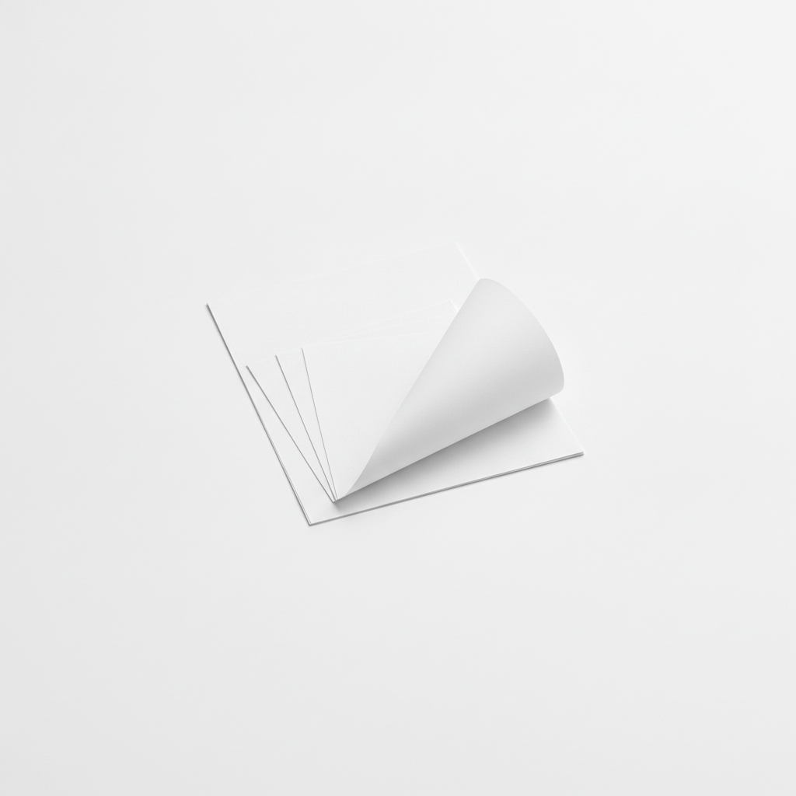 **Sheet/roll stock** §18.1 — A0–A6, Letter/Legal | 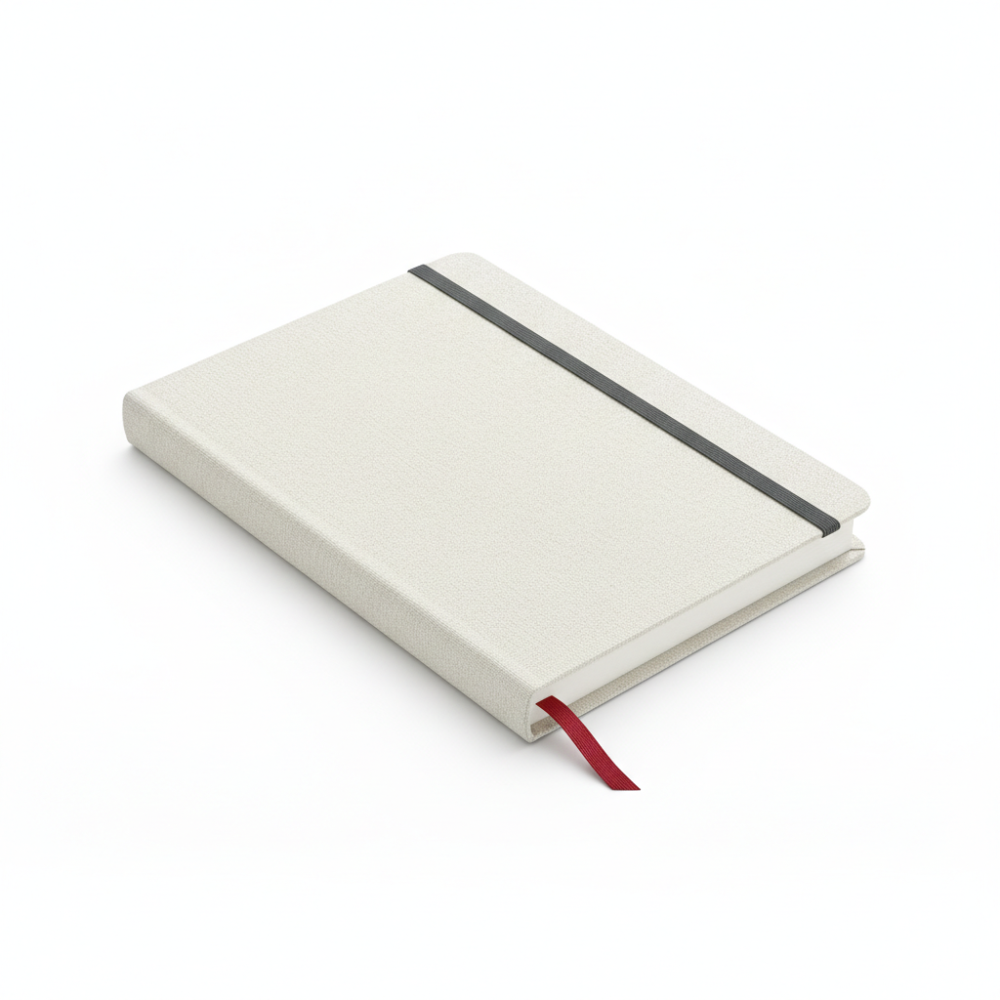 **Notebooks/stationery** §18.2 | 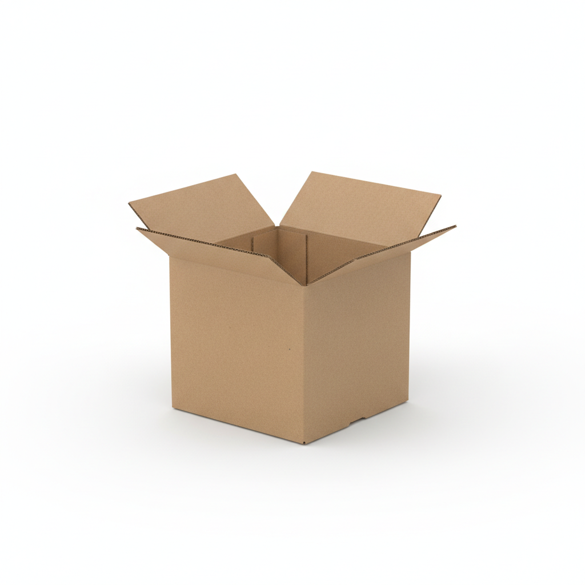 **Cartons** §18.4 — folding, rigid, corrugated, mono |
| 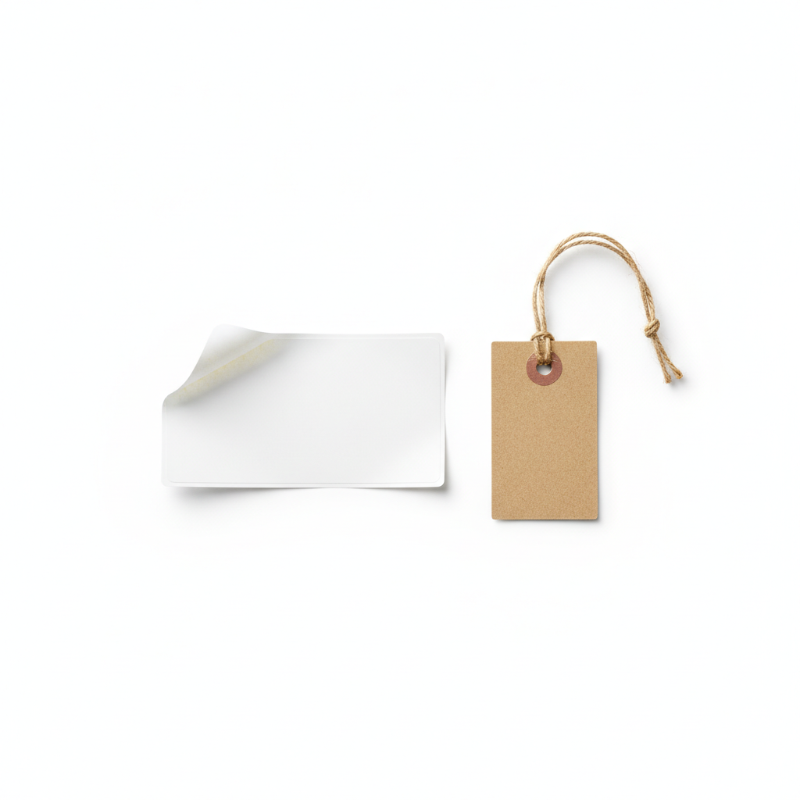 **Labels & tags** §18.5 — adhesive labels, hang tags, signage | 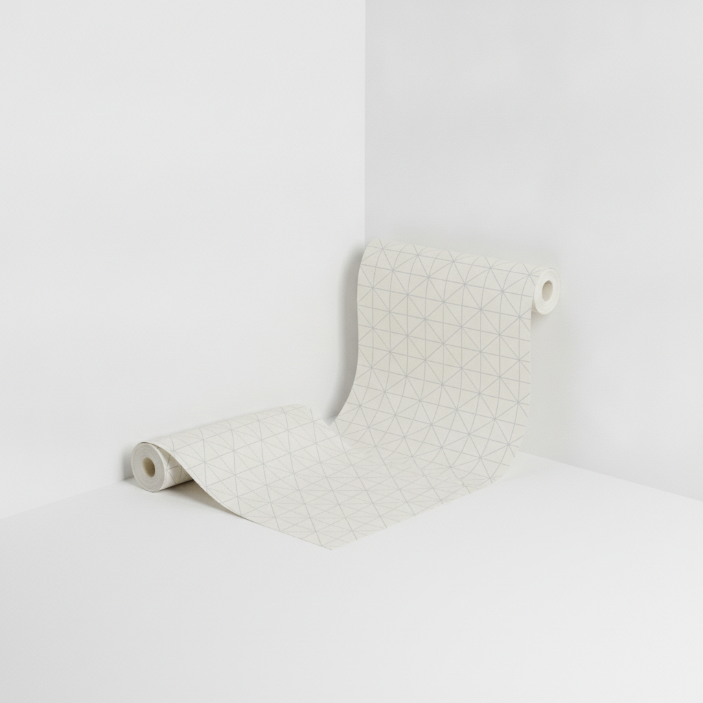 **Wallpaper** §18.6 | 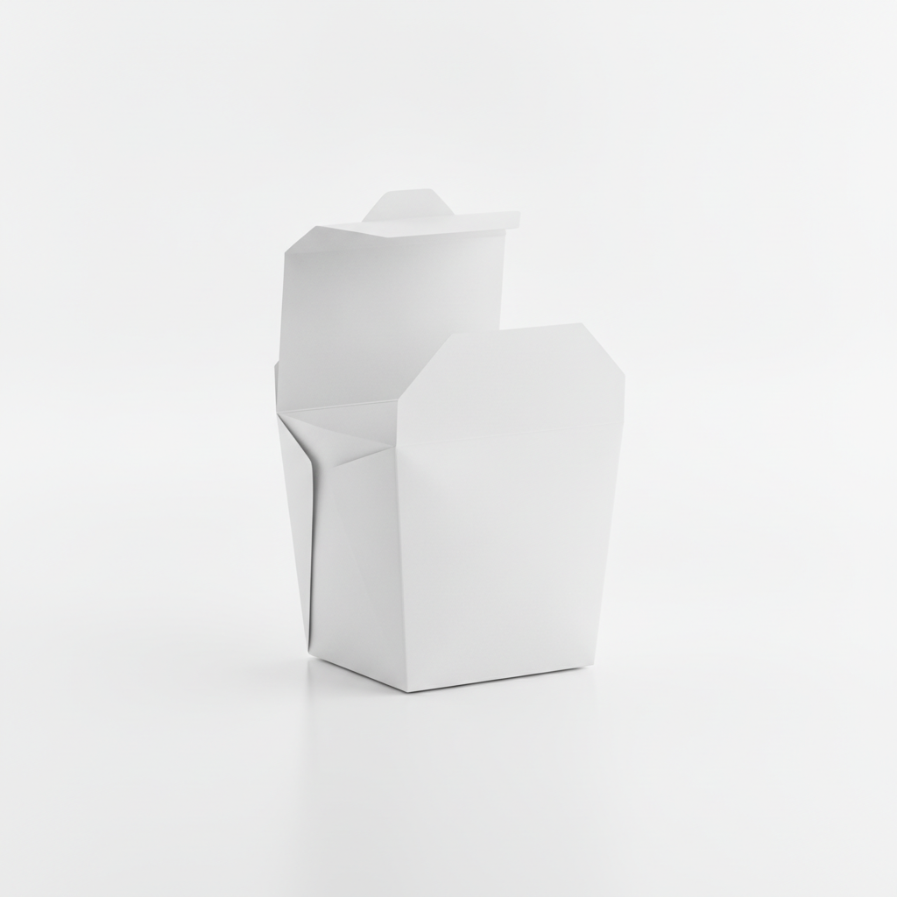 **Food packaging** §18.7 — bakery boxes, wraps |
| 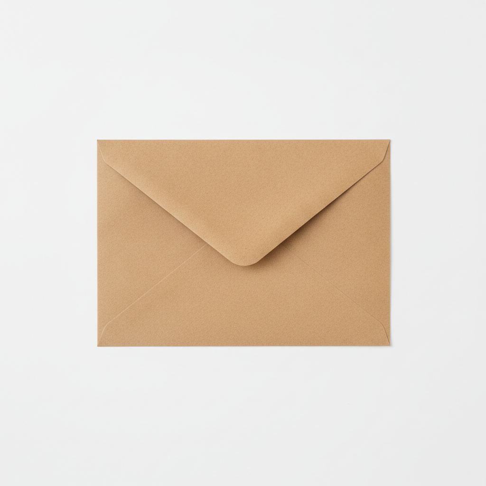 **E-commerce mailers** §18.8 | 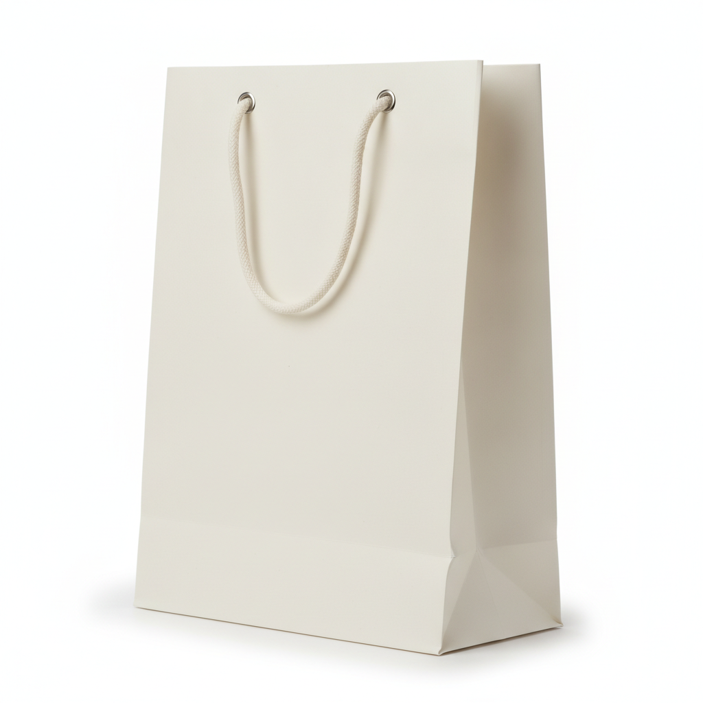 **Premium carry bags** §18.9.2 — expansion horizon | 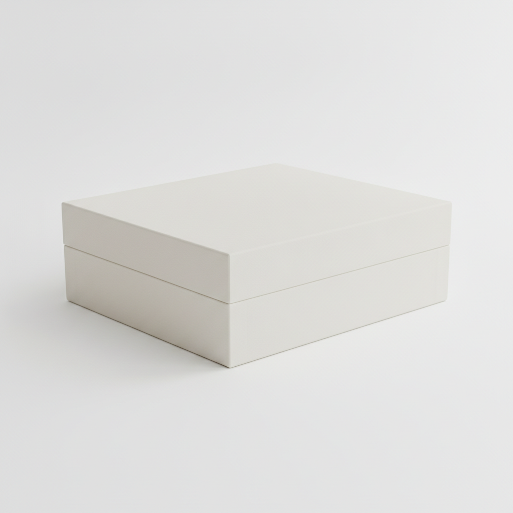 **Rigid box wrap/liner** §18.9.3 — the decorative layer only |

---

## 18.0 How to read this document — methodology and honesty check

* **Every per-sheet/per-unit ₹ figure is derived math, not a vendor quote.** Formula used throughout:

  `Cost per sheet (₹) = GSM (g/m²) × Area (m²) × Price per tonne (₹) ÷ 1,000,000`

  Same "illustrative, bottom-up" approach [03_Unit_Economics.md](03_Unit_Economics.md) §4.2 uses for raw-material cost, one layer further down. A planning reference to sanity-check quotes against — not a rate-card number.

* **Two different ₹/tonne inputs, don't mix them up:**
  * *Production cost* (what it costs **you**) — stone paper ≈ ₹24,000–32,000/t; wood-pulp ≈ ₹42,000–73,000/t (both materials+energy, [03_Unit_Economics.md](03_Unit_Economics.md) §4.6.1).
  * *Market/sell price* — raw stone paper sheet/roll ≈ ₹60,000–108,000+/t wholesale, up to ₹94,000–108,000/t Chinese export-FOB ([13_Paper_Industry_Economics_Deep_Dive.md](13_Paper_Industry_Economics_Deep_Dive.md) §13.4.1); conventional kraft/packaging ex-mill ≈ ₹32,500–33,000/t, writing/printing ≈ ₹45,000–55,000/t (§13.2.1). Retail finished goods sit a further **2–5x** over raw material on both sides.
  * Tables below label which basis each column uses. Never quote a customer a "production cost" number — that's your cost, not a price.

* **GSM is a paper-industry convention; stone paper is usually spec'd by thickness (mm/micron)** — a compounded mineral/polymer sheet, not a fibre mat. Process thickness range: 0.1–0.4mm ([16_Process_Environmental_Profile.md](16_Process_Environmental_Profile.md)). The ~80/18/2 CaCO₃/HDPE/additive mix runs ≈**2.0 g/cm³ density** (derived, mass-weighted) vs. ordinary paper's ≈0.7–0.9 g/cm³. Conversion used throughout:

  `GSM-equivalent = Thickness (mm) × 1000 × Density (g/cm³)`

  **The single most important property difference in this catalog:** at matched *thickness* (matched stiffness/hand-feel — what actually matters to a buyer), stone paper is **≈2.2–2.8x heavier per sheet** than wood-pulp of the same feel, purely from density. So a "same-feel" sheet costs meaningfully more in raw material than a tonne-for-tonne comparison implies. Both bases are shown below.

* **Commercial stone paper GSM conventions** (Karst, Rockstock, TBM/LIMEX, generic IndiaMART) market stationery-grade sheet as "100–120gsm equivalent feel" while actually running 150–250 micron — heavier by weight than the label implies, matched by stiffness/opacity instead. General industry convention, **not verified against this project's own future extrusion output** — get a real vendor spec sheet once a line is commissioned; every number below is a placeholder until then.

* **Printing compatibility is a real property difference — covered in §18.3.** Confirm sheet-press compatibility before quoting a converter.

---

## 18.0.2 Standard pricing rule — what we actually quote

Every ₹ figure elsewhere in this doc is a **substrate cost** — material at production cost, nothing else. Converting, printing, die-cutting, waste, freight and margin sit on top; quoting cost as price is how a plant runs at a loss while its spreadsheet says otherwise.

Standard quoted price across the catalog:

> **Price = cost + min(cost × 70%, ₹2.00)**

* **70%** is the working gross markup on substrate — absorbs conversion/waste/overhead and leaves margin on cheap, high-volume SKUs priced in paise.
* **₹2.00 cap** stops the percentage running away on expensive SKUs. A premium carry bag costs ₹4.23 substrate; an unbounded 70% would push it to ₹7.19 against a ₹5.33 laminated incumbent — 1.35× the thing we're displacing. Capped, it lands at ₹6.23: a real premium, defensible on the property set, still a price a buyer can say yes to.

Below ≈₹2.86 of substrate the 70% binds; above it the cap binds — roughly the line between commodity SKUs (won on price) and premium ones (won on property, priced to look premium).

| SKU | Section | Substrate cost | Markup | **Our price** | Conventional incumbent |
| :---- | :---- | ----: | ----: | ----: | :---- |
| Hang tags, 40×80mm | §18.5 | ₹0.02 | ₹0.01 | **₹0.03** | ₹0.05 |
| Self-adhesive labels, 100×150mm | §18.5 | ₹0.03 | ₹0.02 | **₹0.05** | ₹0.06 |
| QSR wrap, 250×250mm | §18.7 | ₹0.06 | ₹0.04 | **₹0.10** | ₹0.13 |
| Bakery box liner, 200×300mm | §18.7 | ₹0.07 | ₹0.05 | **₹0.12** | ₹0.14 |
| Mailer envelope, 250×350mm | §18.8 | ₹0.20 | ₹0.14 | **₹0.34** | ₹0.40 |
| ID/access card, ID-1 | §18.5 | ₹0.20 | ₹0.14 | **₹0.34** | PVC card — not costed |
| Corrugated liner ply, 0.06 m² | §18.4.2 | ₹0.34 | ₹0.24 | **₹0.58** | ₹0.69 |
| Menu / placemat, A4 | §18.5 | ₹0.39 | ₹0.27 | **₹0.66** | ₹0.81 |
| Folding carton blank, 0.06 m² | §18.4.2 | ₹0.50 | ₹0.35 | **₹0.85** | ₹1.04 |
| Pharma mono-carton, 0.06 m² | §18.4.2 | ₹0.55 | ₹0.39 | **₹0.94** | ₹1.12 |
| Rigid box wrap + liner | §18.9.3 | ₹1.48 | ₹1.04 | **₹2.52** | ₹3.06 |
| Boutique bag, 180×230×90mm | §18.9.2 | ₹2.34 | ₹1.64 | **₹3.98** | ₹2.94 |
| Carry bag, 320×250×120mm | §18.9.2 | ₹4.23 | ₹2.00 *(capped)* | **₹6.23** | ₹5.33 |
| Bridal bag, 400×320×150mm | §18.9.2 | ₹6.55 | ₹2.00 *(capped)* | **₹8.55** | ₹8.25 |
| Wallpaper, per m² | §18.6.5 | ₹8.40 | ₹2.00 *(capped)* | **₹10.40** | Retail category ₹250–1,320/m² |
| Signage panel, 600×900mm | §18.5 | ₹10.58 | ₹2.00 *(capped)* | **₹12.58** | Correx/vinyl — not costed |

**Three things this table is not.** Not a rate card — real quotes move with order size, print coverage, finishing and payment terms, and no buyer has seen these numbers yet. It excludes converting where converting dominates: a finished premium bag needs rope handles, eyelets, a base card, printing and hand-gluing costing several times the substrate, so ₹6.23 is the *bag blank's* worth, not a finished bag's sell price (§18.9.2). And it doesn't survive a move to wholesale-market input pricing — every figure is production-cost basis, and at ₹60,000–108,000/t stone the comparison inverts (§18.0).

Notebooks (§18.2) are excluded on purpose — retail finished-goods prices already carrying 2–5 turns of converting and brand margin, not substrate.

---

## 18.1 Raw Sheet & Roll Stock — Standard Sizes (ISO A-series, Letter/Legal)

*Sizes A0–A6 aren't visually distinguishable in a photo — no per-size image table here, unlike the genuinely distinct product types below.*

The base substrate, before conversion into notebooks, packaging or labels. This is [13_Paper_Industry_Economics_Deep_Dive.md](13_Paper_Industry_Economics_Deep_Dive.md) §13.4.1's "commodity raw-sheet" market — one this plan should **not** compete in directly (Chinese FOB pricing sets a brutal floor), but the right place to start since every converted product below is built from it.

### 18.1.1 Sizes and areas

| Size | Dimensions (mm) | Area (m²) | Typical use |
| :---- | :---- | :---- | :---- |
| A0 | 841 × 1189 | 1.000 | Posters, technical drawings, outdoor signage backing |
| A1 | 594 × 841 | 0.500 | Posters, large-format signage |
| A2 | 420 × 594 | 0.250 | Posters, charts, large diaries |
| A3 | 297 × 420 | 0.125 | Drawing pads, large notebooks, folded brochures |
| A4 | 210 × 297 | 0.0625 | Copier/writing paper, notebook pages, letterheads — the reference size everyone asks about |
| A5 | 148 × 210 | 0.03125 | Notebooks, diaries, half-fold brochures |
| A6 | 105 × 148 | 0.015625 | Postcards, small notepads, index cards |
| Letter (US) | 216 × 279 | 0.0603 | US-market export SKUs |
| Legal (US) | 216 × 356 | 0.0769 | US-market export SKUs, legal documents |

### 18.1.2 A4 — the reference comparison, worked in full

*Standard copier/writing paper runs 70–80 GSM in India (JK Copier, Century, etc. — general market convention, not project-sourced). Stone paper's commercial equivalent for a comparable notebook/writing feel runs ~150 micron (~300 GSM-equivalent at 2.0 g/cm³ density) — i.e. matched by stiffness, not by weight.*

| Metric | Wood-pulp A4 (80 GSM) | Stone paper A4 (150 micron / ~300 GSM-equiv, matched stiffness) | Stone paper A4 (80 GSM-equiv, matched weight — thinner/floppier, not commercially realistic) |
| :---- | :---- | :---- | :---- |
| Weight per sheet | 5.0 g | 18.75 g | 5.0 g |
| Sheets per kg | 200 | 53 | 200 |
| Material cost/sheet at *production cost* (₹42,000–73,000/t wood; ₹24,000–32,000/t stone) | ₹0.21–0.37 | ₹0.45–0.60 | ₹0.12–0.16 |
| Material cost/sheet at *wholesale sell price* (₹45,000–55,000/t wood writing-grade; ₹60,000–108,000/t stone) | ₹0.23–0.28 | ₹1.13–2.03 | ₹0.30–0.54 |
| Cost per ream (500 sheets), production cost | ₹105–185 | ₹225–300 | ₹60–80 |
| Cost per ream (500 sheets), wholesale sell price | ₹115–140 | ₹563–1,013 | ₹150–270 |
| Typical Indian retail ream price (general market reference, not project-sourced) | ₹250–350 | No direct market — stone paper isn't sold as loose copier reams; closest analogue is converted notebook pricing (§18.2) | — |

**The honest read:** at matched thickness/stiffness — the only fair comparison, since a 5g "stone paper" sheet would be flimsier than what it's replacing — stone paper's raw material costs **2–3x more per sheet** at production cost, **4–7x more** at wholesale pricing. Sheet-level version of [13_Paper_Industry_Economics_Deep_Dive.md](13_Paper_Industry_Economics_Deep_Dive.md) §13.5: stone paper doesn't win a commodity cost fight. Loose A4 copier paper is not a SKU this plan should make.

### 18.1.3 A3/A5/A6 and Letter/Legal — scaled from the A4 base

Same GSM assumptions as §18.1.2, scaled by area, production-cost basis (midpoints: ₹57,500/t wood, ₹28,000/t stone).

| Size | Area (m²) | Wood-pulp weight/sheet (g) | Wood-pulp cost/sheet (₹) | Stone paper weight/sheet (g) | Stone paper cost/sheet (₹) | Stone paper premium |
| :---- | :---- | :---- | :---- | :---- | :---- | :---- |
| A0 | 1.000 | 80.0 | 4.60 | 300.0 | 8.40 | 1.8x |
| A1 | 0.500 | 40.0 | 2.30 | 150.0 | 4.20 | 1.8x |
| A2 | 0.250 | 20.0 | 1.15 | 75.0 | 2.10 | 1.8x |
| A3 | 0.125 | 10.0 | 0.58 | 37.5 | 1.05 | 1.8x |
| A4 | 0.0625 | 5.0 | 0.29 | 18.75 | 0.53 | 1.8x |
| A5 | 0.03125 | 2.5 | 0.14 | 9.375 | 0.26 | 1.8x |
| A6 | 0.015625 | 1.25 | 0.07 | 4.6875 | 0.13 | 1.8x |
| Letter | 0.0603 | 4.82 | 0.28 | 18.09 | 0.51 | 1.8x |
| Legal | 0.0769 | 6.15 | 0.35 | 23.07 | 0.65 | 1.8x |

*The 1.8x premium ratio is constant across sizes by construction (it's purely area × GSM × price-per-tonne, all linear) — the only thing that changes between rows is scale. Real-world premiums will vary from this because of the wholesale-vs-production-cost gap shown in §18.1.2, and because a real converter quote bundles in conversion, print, and margin on top of substrate cost.*

---

## 18.2 Notebooks & Stationery — Converted SKUs

[13_Paper_Industry_Economics_Deep_Dive.md](13_Paper_Industry_Economics_Deep_Dive.md) §13.7 ranks this **#1 to lead with** — fastest revenue, no certification barrier, proven willingness-to-pay. Pricing here is **retail finished-goods pricing** (§13.4.2), not the substrate math above — converting, printing, binding and brand margin dominate at this stage of the value chain.

| Image | SKU | Trim size | Page count | Stone paper retail price | Wood-pulp equivalent | Premium |
| :---: | :---- | :---- | :---- | :---- | :---- | :---- |
|  | Hardcover notebook (Karst, global DTC) | A5 (148×210mm) | ~192pg | US $28.95–35.00 (≈₹2,450–2,960) | Premium conventional hardcover notebook (Moleskine-tier), ≈US $18–25 | Comparable — competes as eco-premium vs. premium, not vs. cheap |
| 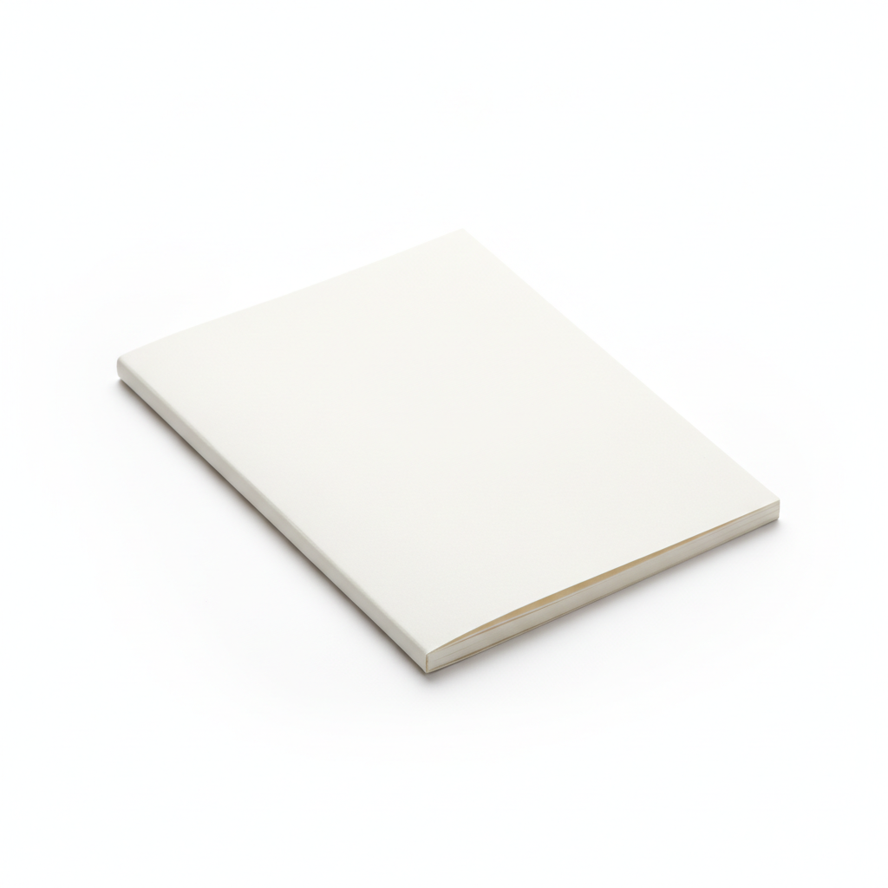 | Softcover notebook (Karst) | A5 (148×210mm) | ~192pg | US $26.95 (≈₹2,280) | Standard softcover conventional notebook, ≈US $10–20 | ~1.5–2.5x |
|  | Pro Series notebook (Karst — same physical format as the hardcover row, premium finish/branding) | A5 (148×210mm) | Professional grade | US $44.95 (≈₹3,800) | — | — |
|  | Stone paper ruled notebook, India (Amazon, general market) | A5/A6 (148×210mm / 105×148mm) | 172–200pg ruled | ₹236–498 post-discount (MRP ₹500–1,499) | Classmate/Navneet-tier ruled notebook, 172–200pg, ₹40–150 | **~2–5x retail**, even post-discount |
|  | Single loose sheet (India, IndiaMART) | 30×40" (~762×1016mm, ~0.774 m²) | 1 sheet | ₹25/sheet | Equivalent-area wood-pulp sheet at 80 GSM ≈ 62g ≈ ₹3.6–4.4 at production cost | ~6–7x |
| 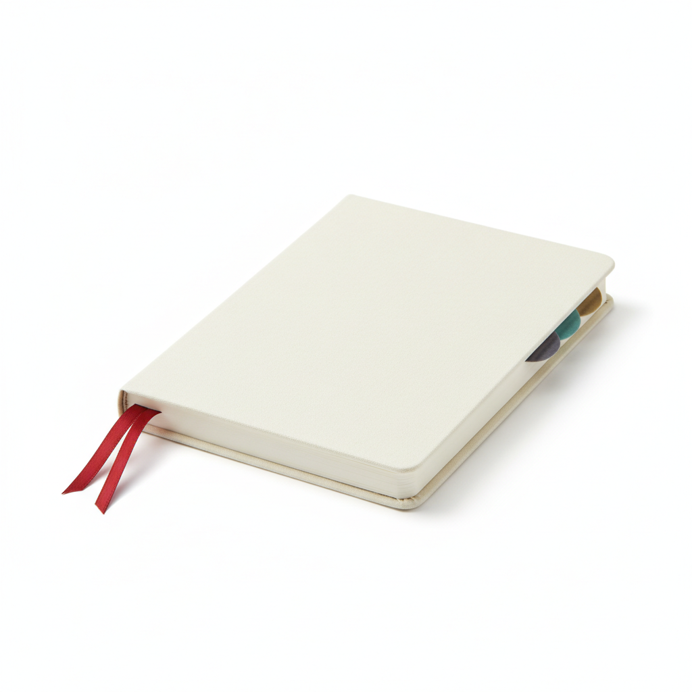 | Diary/planner (implied, not directly priced in project research) | A5 (148×210mm) | Dated diary format, ~300–380pg | Estimate ₹300–900 based on notebook-tier pricing above — **not a sourced figure, directional only** | Standard corporate diary, ₹100–300 | ~2–3x, unverified |

*The Pro Series row reuses the hardcover photo — Karst markets it as the same physical construction with a premium cover finish, not a visually distinct format; the price difference is branding, not a different SKU.*

**Sizing note:** [17_Factory_Operations_Plan.md](17_Factory_Operations_Plan.md) §17.2.2 already budgets a converting/finishing line (₹6–12L) to cut, stitch, fold and trim sheet into these formats — cover printing stays outsourced at Stage 1.

---

## 18.3 Printing Compatibility — the property difference that determines who can even buy this

**A real functional difference, not a cosmetic one — flag it to every prospective converter before they sample, so it isn't a post-order surprise.**

| Printing method | Wood-pulp paper | Stone paper |
| :---- | :---- | :---- |
| Water-based offset/flexo ink | Absorbs normally — standard process | **Does not absorb** — the sheet has no fibre pores; ink sits on the surface and won't dry/set on its own |
| UV-curable offset/flexo ink | Works, less commonly needed | **Required for most commercial stone paper printing** — ink is cured by UV light rather than absorbed, since the polymer surface won't take conventional ink |
| Laser printing/toner | Standard, no caveat | Generally works (toner fuses to the surface rather than absorbing) — **but the HDPE component softens around 120–130°C, and some laser fuser units run hotter; high-heat or double-sided settings on some printers can warp or jam stone paper.** Confirm printer compatibility before bulk laser use, don't assume parity with paper |
| Inkjet (water-based) | Standard | Poor — ink beads/smears without fibre absorption; not a recommended method |
| Screen printing | Works | Works — commonly used for stone-paper packaging/signage |
| Embossing/foil stamping | Standard | Works, generally good result due to the sheet's density/stiffness |

*General stone-paper-industry knowledge (TBM/LIMEX, Karst, generic Chinese spec sheets), **not yet verified against this plant's own formulation or vendor output** — same caveat as the compounding trials in [16_Process_Environmental_Profile.md](16_Process_Environmental_Profile.md) §16.6: get a real print trial on a target converter's actual press before quoting a print-ready spec. Belongs in the lab-certification step in [09_B2B_Client_Acquisition.md](09_B2B_Client_Acquisition.md) §11.2 — procurement wants tear-strength/water-resistance numbers, and a printer wants a proven print trial before committing a press run.*

---

## 18.4 Packaging — Cartons

Pharma secondary packaging is [13_Paper_Industry_Economics_Deep_Dive.md](13_Paper_Industry_Economics_Deep_Dive.md) §13.7's **#2 priority** — buyers already pay for moisture resistance via water-based coatings; stone paper offers it natively.

### 18.4.1 Carton types and fit

| Image | Carton type | What it is | Typical size (illustrative) | Conventional material/GSM | Stone paper fit |
| :---: | :---- | :---- | :---- | :---- | :---- |
|  | Folding carton (reverse/straight tuck) | Pharma secondary packaging, small consumer-goods boxes | ~100×150×40mm blank (pharma strip-pack scale) | Folding Box Board (FBB)/SBS, 250–350 GSM (~0.3–0.4mm) | **Good fit** — stone paper's native 0.1–0.4mm range matches this stock directly; moisture resistance is the selling point pharma buyers already want |
|  | Rigid/set-up box | Premium retail packaging (gifting, electronics) | Highly variable — sized to the product, not a standard blank | Chipboard core wrapped in printed paper, effectively 800+ GSM combined | **Weak fit as the structure, good fit as the wrap** — stone paper alone at 0.4mm max thickness doesn't reach rigid-box stiffness. But the printed wrap and inner liner over that core are 120–157 GSM sheet, which is squarely in range: costed in full at **§18.9.3** |
| 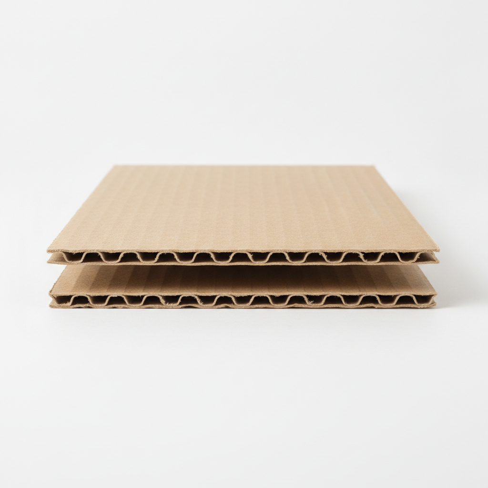 | Corrugated board (fluting + liner) | Shipping cartons, e-commerce outer boxes | Standard e-commerce sizes, e.g. ~230×160×90mm | Fluting medium 100–180 GSM + linerboard 150–300 GSM per ply | **Poor fit for the fluted layer** — corrugating requires a fibre that can be creased into a flute profile without cracking; stone paper's polymer content resists this. Realistic use is as a **printed liner/facing layer** laminated onto conventional corrugated board, not as a replacement for the whole structure |
| 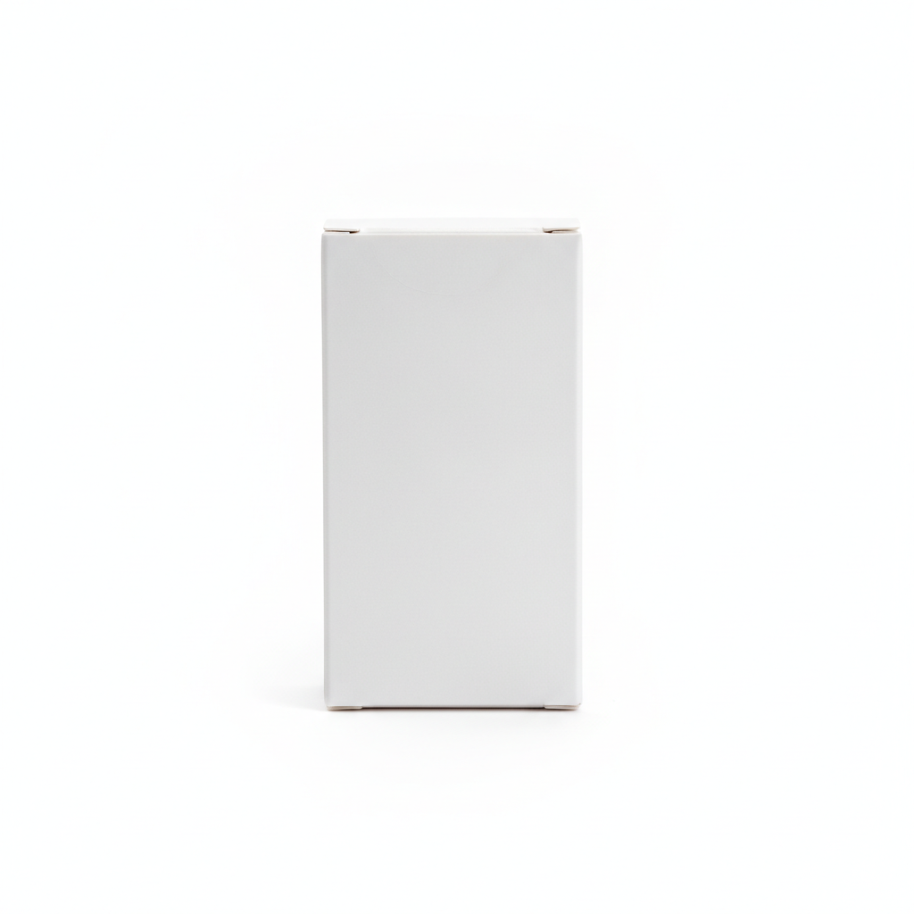 | Mono-carton (single-wall, non-corrugated) | Cosmetics, small pharma units, food-adjacent (non-direct-contact) | ~80×50×120mm (small cosmetic/pharma unit carton) | Kraft/duplex board, 250–400 GSM | **Good fit** — same logic as folding cartons; this is the realistic entry SKU |

### 18.4.2 Illustrative cost, per carton type

*Representative 0.06 m² carton blank (flattened die-cut area, before trim waste) at each type's mid-range GSM, production-cost basis (₹57,500/t wood, ₹28,000/t stone). Rigid boxes excluded — stone paper isn't a standalone substrate for that construction (§18.4.1).*

| Carton type | Representative GSM | Weight per blank | Wood-pulp cost/blank (production cost) | Stone paper cost/blank (production cost) | Note |
| :---- | :---- | :---- | :---- | :---- | :---- |
| Folding carton | 300 GSM | 18 g | ₹1.04 | ₹0.50 | Moisture resistance native to stone paper vs. an added coating step for wood-pulp board |
| Corrugated — liner/facing layer only | 200 GSM (single liner ply, not the full fluted board) | 12 g | ₹0.69 | ₹0.34 | This costs only the printed liner stone paper would realistically supply, not the fluted core beneath it |
| Mono-carton | 325 GSM | 19.5 g | ₹1.12 | ₹0.55 | Same logic as folding carton, slightly heavier stock |

**What we quote:** see §18.0.2 — price = cost + min(cost × 70%, ₹2.00).

*At matched weight (cartons are conventionally spec'd by GSM already, so this is the fairer comparison), stone paper's production cost runs genuinely cheaper across every fitting carton type — the pharma pitch holds structurally. Wholesale pricing tells a different story: at ₹60,000–108,000+/t stone vs. ₹32,500–55,000/t conventional board ([13_Paper_Industry_Economics_Deep_Dive.md](13_Paper_Industry_Economics_Deep_Dive.md) §13.4), the same blanks cost roughly **1.1–3.3x more** (midpoint ~2x) at market sell price. Don't sell this as commodity raw board — sell the native moisture-resistance that skips the buyer's coating step, priced against coating-inclusive conventional cost, not bare-board cost.*

---

## 18.5 Labels & Tags — the highest-margin segment identified

[13_Paper_Industry_Economics_Deep_Dive.md](13_Paper_Industry_Economics_Deep_Dive.md) §13.7 ranks this **#3**, flagged as **best margin-per-tonne** — waterproof/tear-resistant is the entire purchase criterion, no compromise needed, and the competitive set is 100%-petroleum PVC/PP synthetic paper (Cosmo Films, Tirupati Marketing), not conventional paper.

*No project-sourced ₹/unit pricing exists here — §13.7 flags it as a margin opportunity, not a costed SKU list. Stone-paper substrate costs below use the same §18.0 formula on this project's own ₹/tonne figures. Where the real incumbent is plastic (PVC ID cards, corflute signage) with no project-sourced ₹/tonne figure, only the property-fit call is given, not a fabricated cost comparison.*

| Image | SKU | Typical size | Typical stock | Wood-pulp cost/unit (production cost) | Stone paper cost/unit (production cost) | Conventional/incumbent material | Stone paper property match |
| :---: | :---- | :---- | :---- | :---- | :---- | :---- | :---- |
| 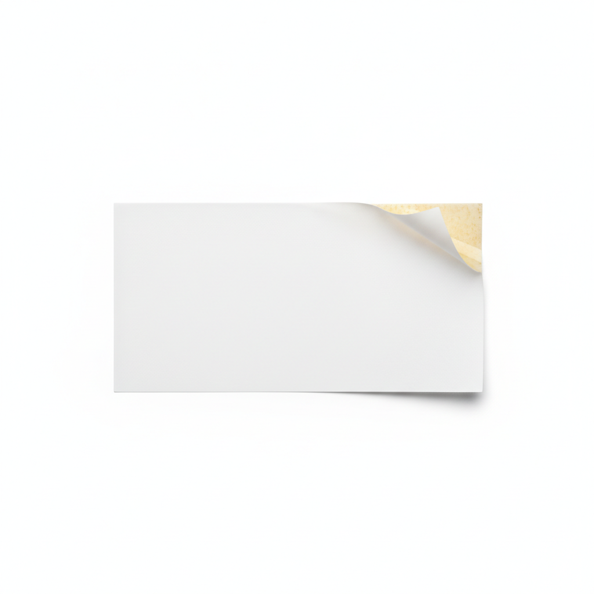 | Self-adhesive labels (pressure-sensitive) | ~100×150mm face (0.015 m²) | Face stock 60–90 GSM + adhesive + release liner | ₹0.06 (at 75 GSM mid-range) | ₹0.03 | Paper face stock (absorbs moisture, tears) or PVC/PP synthetic face stock (petroleum-based) | Waterproof + tear-resistant natively, tree-free alternative to PVC/PP — direct competitive angle against synthetic-paper incumbents, not ordinary paper labels |
| 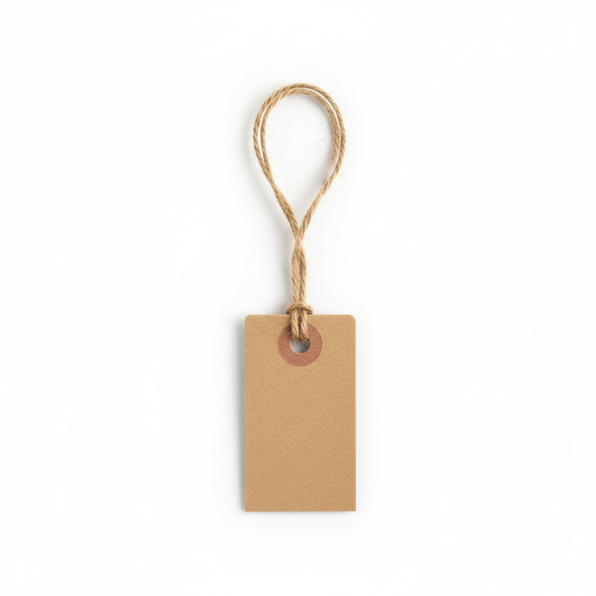 | Hang tags (garment/footwear) | ~40×80mm (0.0032 m²) | 180–300 GSM rigid stock | ₹0.05 (at 250 GSM mid-range) | ₹0.02 | Kraft/card tag stock | Adidas's global use of stone-paper shoe hang tags ([13_Paper_Industry_Economics_Deep_Dive.md](13_Paper_Industry_Economics_Deep_Dive.md) §13.7) is a proven, exportable use case — good stiffness match at stone paper's higher end (0.3–0.4mm) |
| 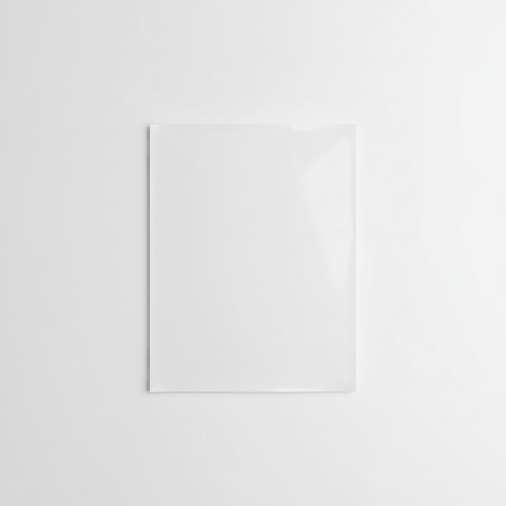 | Menus / placemats | ~A4, 210×297mm (0.0625 m²) | 200–250 GSM, laminated for wipe-clean use | ₹0.81 (at 225 GSM mid-range) | ₹0.39 | Paper + plastic lamination | Native waterproof/wipe-clean property removes the lamination step entirely |
| 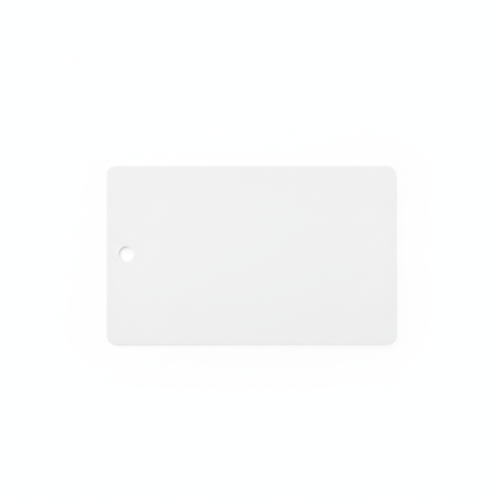 | ID/access cards | ISO/IEC 7810 ID-1, 85.6×54mm (0.0046 m²) | Rigid, ~0.76mm (standard "CR80" card thickness) | Not costed — incumbent is PVC, not wood-pulp paper; no project-sourced PVC ₹/tonne figure | Substrate-only estimate ≈₹0.20 at 0.76mm/~1,520 GSM-equivalent, production cost — **card-grade stiffness at this thickness is unverified for stone paper**, treat as a rough floor only | PVC card | Direct plastic-alternative angle in principle; PVC cards are a mature, very cheap, thin incumbent — a harder displacement than labels/tags, and the property-match case is weaker here than elsewhere in this table |
| 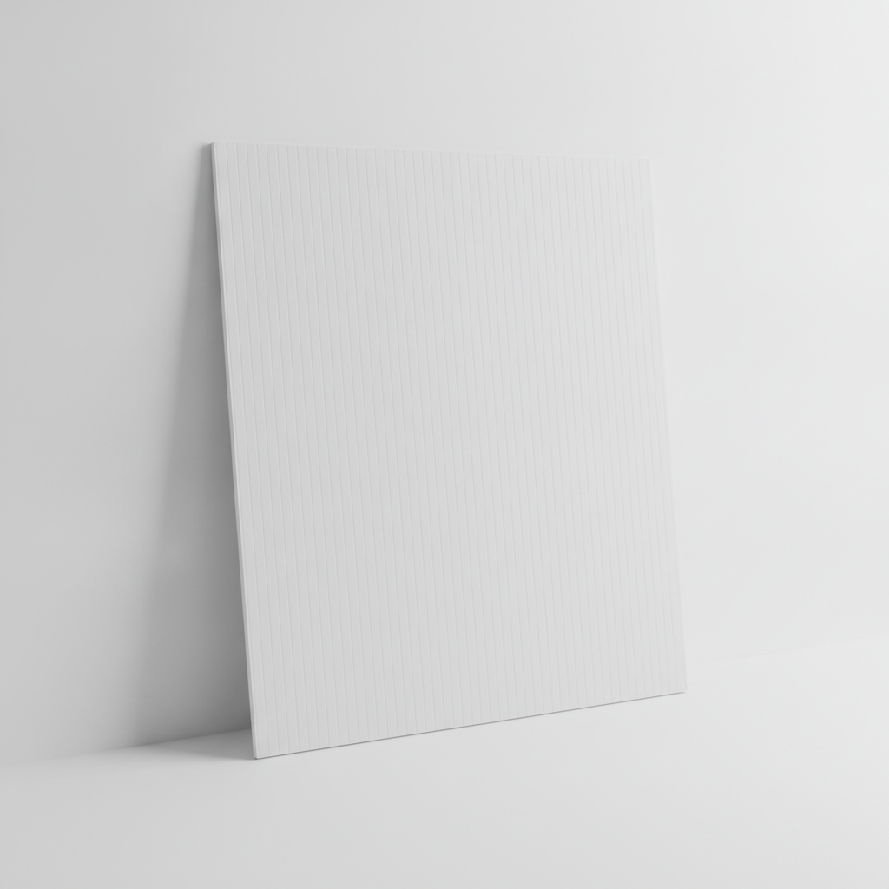 | Outdoor signage / banners | ~600×900mm panel (0.54 m²) | Thick sheet, 0.3–0.4mm+ | Not costed — incumbent is corrugated plastic (Correx/Coroplast) or vinyl, not wood-pulp paper; no project-sourced ₹/tonne figure for either | ≈₹10.58 at 0.35mm/700 GSM-equivalent, production cost | Corrugated plastic (Correx/Coroplast) or vinyl banner | Waterproof/UV-exposed use case fits stone paper's core property set well; direct cost comparison depends on a real corflute/vinyl quote, not available in this research pass |

**What we quote:** see §18.0.2 — price = cost + min(cost × 70%, ₹2.00).

---

## 18.6 Wall Coverings — Wallpaper

*Not covered in existing research docs (03/13/16) — market sizing, pricing and printing-process detail below is general home-décor/wallpaper-industry knowledge, not project-sourced. Treat every figure as a hypothesis to verify with real Indian distributors/printers, same rigor [03_Unit_Economics.md](03_Unit_Economics.md) applies to its own numbers.*

### 18.6.1 Why this is worth a serious look

* India's residential/commercial wallpaper market is growing (Asian Paints Nilaya, Marshalls Wallcoverings, Excel, D'decor) riding the same interior-décor boom as tile/paint/flooring — no verified India market-size figure found in this pass; get one before sizing go/no-go, the way [02_Market_Opportunity.md](02_Market_Opportunity.md) sizes the core market.
* Stone paper's properties map onto a real, underserved pain point: conventional non-woven/paper wallpaper struggles with mold/peeling in humid rooms — exactly India's climate, exactly the native waterproof property [01_Core_Idea_Pitch_Summary.md](01_Core_Idea_Pitch_Summary.md) leads with.
* Sits alongside, not instead of, §18.5's labels/signage segment — same pitch (waterproof/tear-resistant beats coated/laminated substrate), different converting line and buyer (interior contractors/distributors, not packaging converters).

### 18.6.2 Wallpaper types and stone paper fit

| Image | Type | Typical construction | Conventional GSM/thickness | Stone paper fit |
| :---: | :---- | :---- | :---- | :---- |
|  | Non-woven wallpaper (most common modern type) | Cellulose/synthetic-fibre non-woven base, printed, sometimes lightly coated | 150–250 GSM | Weak fit as a direct substitute — non-woven's "paste the wall" installation method relies on backing porosity to breathe and release; a dense polymer/mineral composite doesn't behave the same way on a wall |
| 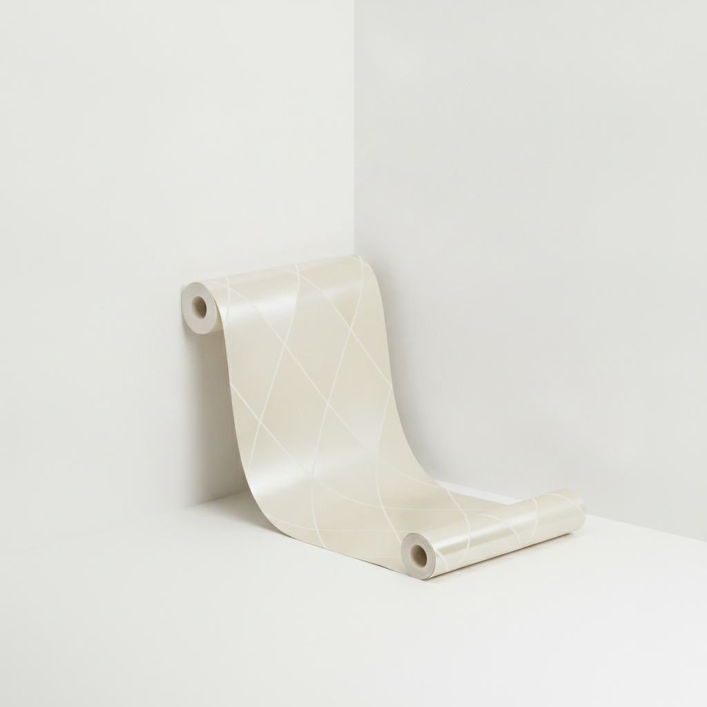 | Vinyl-coated paper wallpaper | Paper base + PVC coating for wipeability | 200–300 GSM base + coating | **Closer fit** — stone paper is effectively "pre-coated" for water resistance, so it could replace the paper-base-plus-coating construction in one layer, if adhesion/installation (§18.6.4) is solved |
| 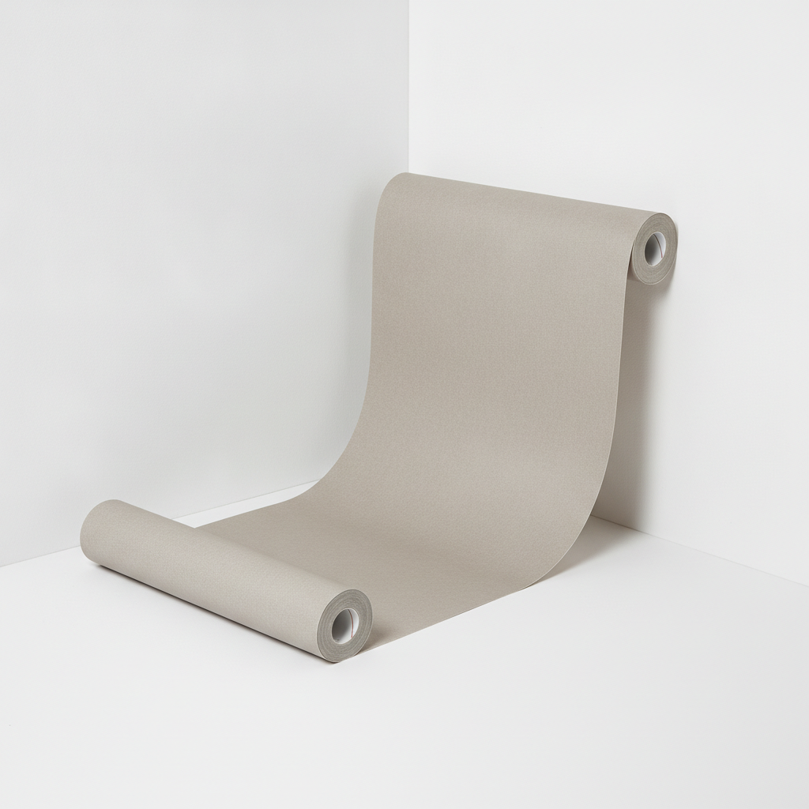 | Solid vinyl/PVC wallpaper | Full PVC sheet, sometimes fabric-backed | 300–500+ GSM equivalent | Closest functional match — both are polymer-heavy and waterproof, used in the same wet-area use case; stone paper's pitch here is "lower-plastic-fraction, marble-waste-diverted alternative to 100% PVC," not a cost play |
| 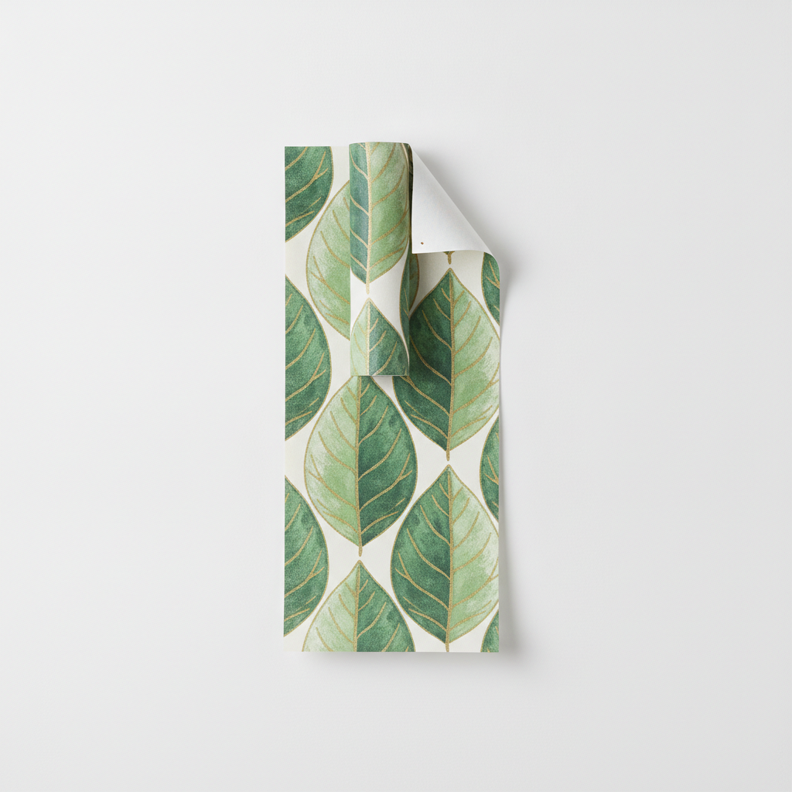 | Peel-and-stick (self-adhesive) wallpaper | Printed film + pre-applied adhesive backing + release liner | Vinyl/polymer film, no wet paste needed | **Best installation-method match** — see §18.6.4; sidesteps the wet-paste-adhesion problem entirely by design |
| 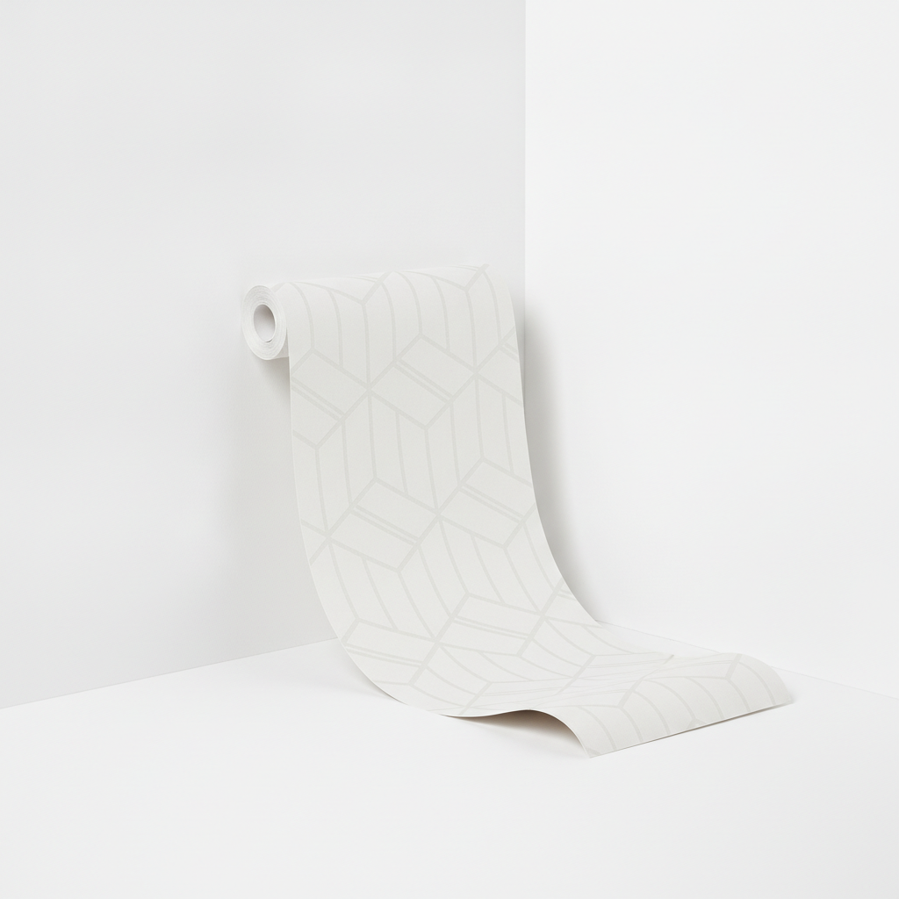 | Textured/embossed (3D foam) wallpaper | Foamed PVC or flocked paper | Variable, often 400+ GSM equivalent | Not a good fit — stone paper's calendered/compounded process doesn't produce the foamed/embossed texture this category depends on, without added tooling |

### 18.6.3 Printing — the crucial factor

Matters more here than any other SKU, because **wallpaper's entire commercial value is the printed pattern** — an off-spec print doesn't just look worse, it kills the product, unlike a plain packaging carton.

| Printing method used in the wallpaper industry today | Ink/process | Works on stone paper? |
| :---- | :---- | :---- |
| Rotogravure (mass-market, high-volume runs) | Water-based or solvent-based ink, absorbed into the fibre/coating | **No, not without a process change** — same root issue as §18.3: stone paper's surface doesn't absorb ink, and gravure cylinders are engraved per-pattern, expensive to requalify for a different ink chemistry |
| Rotary screen printing | Thicker ink, often water-based, deposited rather than absorbed | Partial fit — screen printing already works reasonably on stone paper per §18.3; feasible for large flat-colour pattern runs, less so for fine photographic-quality repeats |
| Digital/large-format inkjet (UV-curable or latex) — the fast-growing **custom/on-demand wallpaper segment** | UV-cured or latex ink, cured/dried on the surface rather than absorbed | **Good fit** — this is the one wallpaper-printing method already ink-chemistry-compatible with stone paper (§18.3 already flags UV-curable ink as stone paper's native printing route). Custom/on-demand wallpaper (print-to-order by room dimensions, custom photo/pattern uploads) is exactly where digital UV/latex presses already dominate, for reasons unrelated to stone paper — the alignment is a genuine strategic opening, not a coincidence to force |

**The practical conclusion:** don't chase mass-market gravure-printed wallpaper (the volume segment) — the ink-chemistry mismatch is a real production blocker. **Do** look at the custom/on-demand digital wallpaper niche, where UV/latex large-format printing is already the standard process regardless of substrate — stone paper slots into an existing compatible workflow there.

### 18.6.4 Installation — a second real gap, adjacent to the printing one

Wallpaper gets pasted (or peeled-and-stuck) onto a wall — a step packaging/labels/notebooks don't have to solve. Conventional non-woven wallpaper relies on a porous backing to grip paste; stone paper's dense, non-porous composite has the same absorption problem on its back as on its printable face (§18.3). **Peel-and-stick (self-adhesive) sidesteps this entirely** via a factory-applied adhesive layer — very likely the only commercially realistic installation format here, not incidental. Also the fastest-growing wallpaper sub-category globally (rental/DIY-friendly) — but needs its own adhesive-lamination converting step, not currently budgeted anywhere, distinct from the cut/stitch/fold/trim line in [17_Factory_Operations_Plan.md](17_Factory_Operations_Plan.md) §17.2.2.

### 18.6.5 Illustrative pricing comparison

*India retail wallpaper pricing is general market knowledge, **not sourced from this project's own research** — verify with distributors (Marshalls, Nilaya-stockists, local wholesalers) before underwriting any plan around it. Standard roll size: 0.53m × 10m ≈ 5.3 m².*

| Product | Price per roll (~5.3 m²) | Price per m² | Notes |
| :---- | :---- | :---- | :---- |
| Budget non-woven wallpaper (imported, basic pattern) | ₹1,300–2,700 | ₹250–500 | Largest volume segment in India today |
| Mid/premium non-woven (Asian Paints Nilaya, Marshalls-tier) | ₹2,700–8,000+ | ₹500–1,500+ | Brand and design-led pricing, not substrate-cost-led |
| Solid vinyl/PVC wallpaper | ₹2,000–5,000 | ₹380–950 | Closest existing category to a stone-paper wallpaper's physical profile |
| Peel-and-stick vinyl wallpaper | ₹3,000–7,000 | ₹570–1,320 | Growing DIY segment, and the installation format §18.6.4 flags as the realistic fit |
| **Stone paper wallpaper — cost-derived estimate, not a market price** | — | Production cost at 300 GSM-equivalent (0.15mm), midpoint ₹28,000/t: **≈₹8.40/m²** substrate-only, before adhesive lamination, printing and converting | Substrate cost alone sits *below* every conventional retail category above — but retail wallpaper pricing is overwhelmingly design/brand-driven, not substrate-cost-driven (same dynamic already established for stone-paper notebooks in §18.2), so this gap says little about achievable retail pricing on its own |

**What we quote:** see §18.0.2 — price = cost + min(cost × 70%, ₹2.00).

### 18.6.6 Verdict

| Dimension | Read |
| :---- | :---- |
| Property fit | Strong — waterproof/mold-resistant natively addresses a real, common Indian wallpaper failure mode |
| Printing fit | Conditional — incompatible with mass-market gravure, genuinely compatible with the growing digital/custom UV-print niche |
| Installation fit | Conditional — wet-paste non-woven format doesn't work; peel-and-stick very likely does, but needs a new adhesive-lamination step not yet budgeted anywhere in this plan |
| Cost fit | Favorable at substrate level, unproven at retail (design/brand drives wallpaper retail pricing, not raw material) |
| Research maturity | **Lowest of any segment in this catalog** — no project-sourced market sizing, competitor, or certification data exists yet; treat as a segment worth a scoping call to 2–3 Indian wallpaper distributors/printers before committing any capex or converting-line design to it |

---

## 18.7 Food Packaging (Grease-Resistant) — deprioritized, included for completeness

[13_Paper_Industry_Economics_Deep_Dive.md](13_Paper_Industry_Economics_Deep_Dive.md) §13.7 ranks this **#6, deprioritize initially** — established cellulose-based grease-resistant players hold proven FSSAI food-contact certification, a harder entry than the segments above.

*Revised 31 August 2026: this segment was on the founder's near-term priority list. [07_Capital_Plan.md](07_Capital_Plan.md) §9.2.1 and [17_Factory_Operations_Plan.md](17_Factory_Operations_Plan.md) §17.2.2 hold the line: no dedicated capex at Stage 1, but sample pieces trial-run on the core converting line's existing output (same die-cutting/trimming as tags and menus) to test material fit and gauge interest ahead of FSSAI clearance — a cheap way to start the conversation without buying equipment against an unresolved certification gate.*

| Image | SKU | Typical size | Conventional material/GSM | Wood-pulp cost/unit (production cost) | Stone paper cost/unit (production cost) | Stone paper consideration |
| :---: | :---- | :---- | :---- | :---- | :---- | :---- |
|  | Bakery box liners | ~200×300mm liner sheet (0.06 m²) | Glassine/greaseproof paper, 30–50 GSM | ₹0.14 (at 40 GSM mid-range) | ₹0.07 | Native grease/moisture resistance is a genuine fit, but **FSSAI food-contact certification for the HDPE component is an unverified gate** — confirm before any direct food-contact pitch, per [09_B2B_Client_Acquisition.md](09_B2B_Client_Acquisition.md) segment note |
| 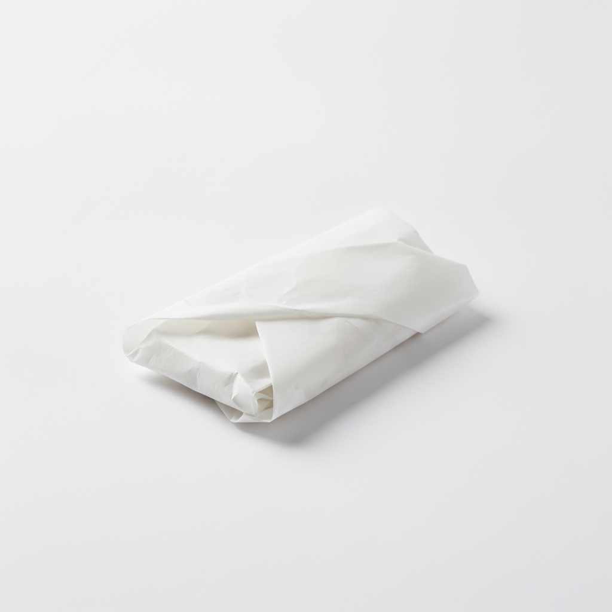 | QSR wraps | ~250×250mm wrap sheet (0.0625 m²) | Greaseproof paper, 30–40 GSM | ₹0.13 (at 35 GSM mid-range) | ₹0.06 | Same certification gate applies |

*Both cost columns use general wood-pulp production-cost figures ([03_Unit_Economics.md](03_Unit_Economics.md) §4.6.1), not a glassine-specific price — no project-sourced figure exists for glassine specifically. Directional, same as every other derived cost in this doc.*

**Recommended sequencing:** revisit as a non-direct-food-contact application (e.g., outer bakery box, not inner wrap) once quality and certifications are proven in the higher-priority segments above.

**What we quote:** see §18.0.2 — price = cost + min(cost × 70%, ₹2.00).

---

## 18.8 E-commerce Mailers/Labels — large market, approach selectively

[13_Paper_Industry_Economics_Deep_Dive.md](13_Paper_Industry_Economics_Deep_Dive.md) §13.7 ranks this **#4** — deprioritized because poly mailers cost ₹1.30–6/piece, structurally 30–50% cheaper than any paper alternative at marketplace scale. Not a volume play; approach premium D2C brands wanting an "unboxing" sustainability story, not Amazon/Flipkart/Meesho RFPs directly.

| Image | SKU | Typical size | Conventional material | Wood-pulp cost/unit (production cost) | Stone paper cost/unit (production cost) | Stone paper positioning |
| :---: | :---- | :---- | :---- | :---- | :---- | :---- |
|  | Padded/kraft mailer envelope | ~250×350mm (0.0875 m²) | Kraft paper, 70–90 GSM, sometimes poly-lined | ₹0.40 (at 80 GSM mid-range) | ₹0.20 | Waterproof property removes the poly-lining need; pitch on tactile/brand story to premium D2C, not on price — and note the substrate cost is favorable here too, same dynamic as cartons in §18.4 |
| 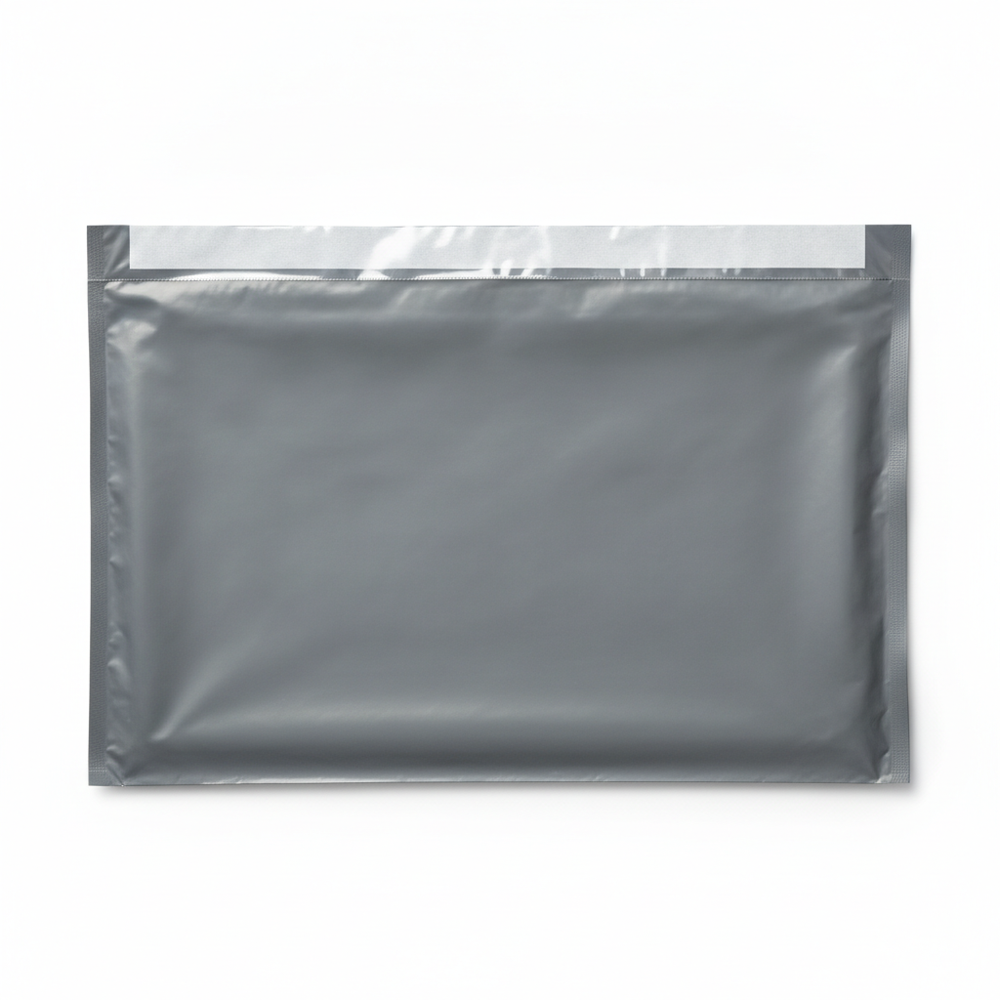 | Poly mailer (the actual incumbent at scale) | Standard e-commerce sizes | HDPE/LDPE film, ₹1.30–6/piece (project-sourced, [13_Paper_Industry_Economics_Deep_Dive.md](13_Paper_Industry_Economics_Deep_Dive.md) §13.7) | — | Stone paper cannot win this fight on cost — the poly mailer's own sourced price undercuts even the derived kraft-mailer figures above | Don't target this SKU as a volume replacement |

**What we quote:** see §18.0.2 — price = cost + min(cost × 70%, ₹2.00).

---

## 18.9 Premium Retail Packaging — Carry Bags & Rigid Boxes

*Not covered in existing research docs (03/13/16) — added 30 August 2026 as an **expansion-horizon** category. The substrate arithmetic uses the same §18.0 formula and project ₹/tonne inputs as every other section, so the cost figures are as sound as the rest. The **market positioning is a hypothesis, not research**: no Indian premium-packaging buyer interviewed, no converter quote, no sample. Treat §18.9.2–18.9.3 as a costed option to take to a buyer, not a validated segment.*

### 18.9.1 Why this category is worth costing

§18.4–18.8 are all a **volume** argument: thin margins, big runs, price-sensitive converters. This section is the opposite — low volume, high ticket, a buyer choosing on brand and feel, not ₹/blank. It answers a fair investor question the rest of the catalog doesn't: *where does this material go once the commodity SKUs are running?*

Three reasons it's not merely aspirational:

* **The honest incumbent is laminated paper, not paper.** Every premium bag/rigid box is matte- or gloss-laminated — BOPP plastic film bonded to paper, two materials plus an extra process step, a composite no Indian recycling stream separates. Our one-material sheet delivers the same wipe-clean durability and feel — the identical argument §18.5 makes for menus/placemats, at a higher value point.
* **Handle tear-out is the #1 failure mode of premium carry bags** — the rope-handle punch point. Tear resistance is stone paper's strongest single property ([01_Core_Idea_Pitch_Summary.md](01_Core_Idea_Pitch_Summary.md) §2).
* **Monsoon.** A bag carrying ₹2 lakh of jewellery that fails in rain is a brand incident. Native waterproofing is worth more here than in any commodity SKU.

> **⚠ Do not market this category as "biodegradable."** At the standard 80/18/2 formulation the sheet is ~18% HDPE and fails EN 13432, ASTM D6400 and TÜV OK Compost ([16_Process_Environmental_Profile.md](16_Process_Environmental_Profile.md) §16.4, §18.10 below). Premium-brand sustainability teams are exactly the buyers who audit this claim. Defensible claims: *tree-free, water-free process, marble-waste diverted, lower plastic fraction than the BOPP-laminated paper it replaces.* A genuine compostable claim needs the PBAT variant **plus** EN 13432 certification on the finished article — a funded 6–12 month item, not a datasheet line.

### 18.9.2 Carry bags — sizes, areas and cost

*Blank area is the flattened die-cut: body tube (perimeter × height + 40mm top turnover) + bottom panel (40% uplift for four bottom flaps) + 20mm side glue flap. Stone paper spec'd at **0.24mm (~480 GSM-equivalent at 2.0 g/cm³)** to match the caliper/stiffness of the 250 GSM coated art paper these bags conventionally use — per §18.1.2 the only fair basis. Production-cost basis: ₹28,000/t stone, ₹57,500/t wood-pulp, ₹150,000/t BOPP matte film (17 GSM at 0.91 g/cm³).*

| Image | SKU | Dimensions (W×H×D) | Blank area | Stone paper cost/bag | 250 GSM art + BOPP lamination | Verdict |
| :---: | :---- | :---- | :---- | :---- | :---- | :---- |
| 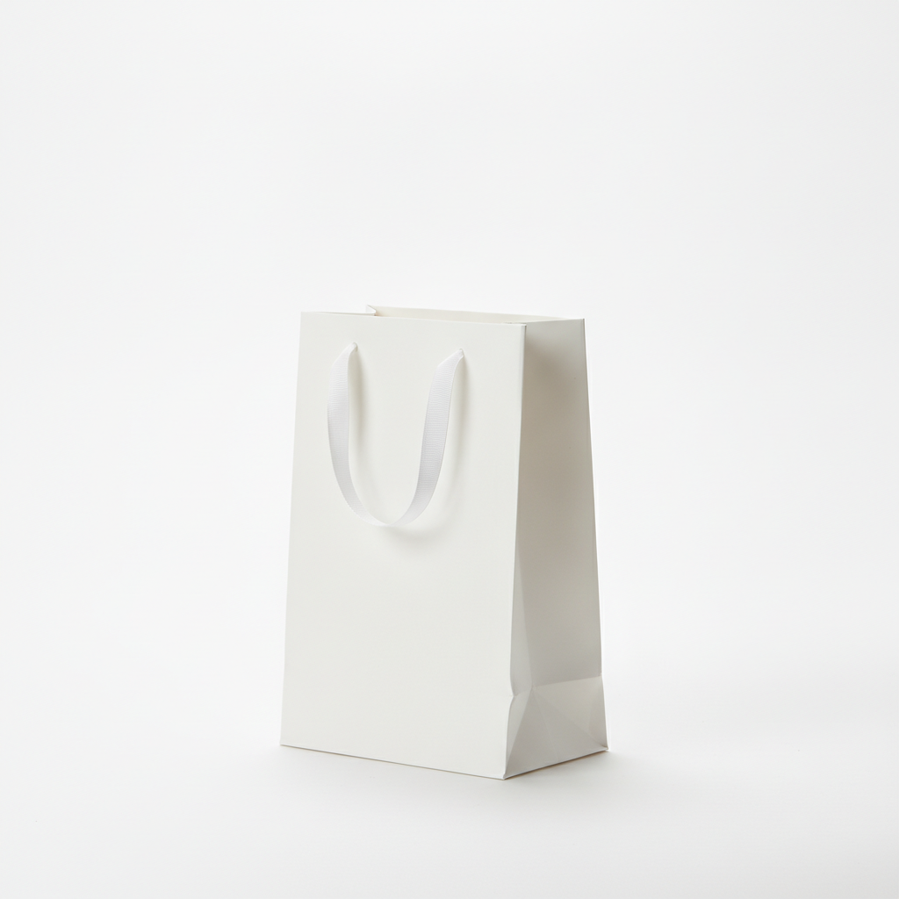 | Boutique / jewellery bag | 180×230×90mm | 0.174 m² | **₹2.34** | ₹2.94 (₹2.50 + ₹0.44 film) | Cheaper, and one material instead of two |
|  | Retail standard carry bag | 320×250×120mm | 0.315 m² | **₹4.23** | ₹5.33 (₹4.52 + ₹0.80 film) | The reference size — apparel, footwear, D2C |
|  | Bridal / large gift bag | 400×320×150mm | 0.487 m² | **₹6.55** | ₹8.25 (₹7.00 + ₹1.24 film) | Highest ticket; wedding/festive seasonality |

**What we quote:** see §18.0.2 — price = cost + min(cost × 70%, ₹2.00).

**The read:** stone paper lands **roughly 20% below** the laminated incumbent on substrate at production cost, *and* removes the lamination step from the converter's process. Excluded on both sides: rope handles, eyelets, base insert card, printing, die-cutting, gluing and hand-finishing — those dominate a finished bag, which retails at ₹12–40 (standard) to ₹60–200 (bridal/luxury), so substrate is well under a fifth of sell price. **Not a category won on substrate cost. Cost parity is the ticket to entry; the property set and single-material story are the sale.**

At *wholesale market* pricing (₹60,000–108,000/t stone vs ₹45,000–70,000/t premium coated art, [13_Paper_Industry_Economics_Deep_Dive.md](13_Paper_Industry_Economics_Deep_Dive.md) §13.4) the comparison inverts to roughly 2–3× more expensive, as everywhere else in this catalog. Sell the property, price against lamination-inclusive conventional cost.

### 18.9.3 Rigid / set-up boxes — what we can actually supply

§18.4.1 rules out rigid boxes as a **standalone substrate**, and that stands: bending stiffness scales with the cube of caliper, so a 1.5mm greyboard core against our 0.4mm ceiling is ~53× on that term alone, and stone paper's modulus doesn't close it. **We cannot be the structure of a rigid box.**

But a rigid box isn't one material — it's a greyboard core **wrapped** in a thin printed decorative sheet, with a second sheet lining the inside, and that wrap is 120–157 GSM art paper, well inside what this line makes. At our 0.1mm process floor (~200 GSM-equivalent) our sheet is *thinner* than a 157 GSM art wrap (~0.15mm), so it turns corners and edge-tucks more cleanly, not less. Stone paper creases without cracking — the exact property that disqualifies us from corrugated fluting (§18.4.1) is an asset on a box turn-in.

*Worked on a 200×150×50mm two-piece box (base + shallow lid): greyboard core area 0.113 m²; decorative layer 0.264 m² (outer wrap + inner liner incl. 15mm turn-ins). Greyboard costed at 1.5mm/0.75 g/cm³ (~1,125 GSM) at ₹35,000/t — general Indian recycled-greyboard market reference, **not a project-sourced figure**.*

| Box component | Who supplies it | Stone paper build | Conventional build |
| :---- | :---- | :---- | :---- |
| Greyboard core (1.5mm) | **Bought in — not us**, identical on both sides | ₹4.43 | ₹4.43 |
| Decorative wrap + liner | **This is our SKU** | **₹1.48** (0.1mm stone, no lamination) | ₹3.06 (157 GSM art ₹2.40 + BOPP film ₹0.66) |
| **Full box, materials only** | | **₹5.91** | ₹7.49 |

**The honest framing for an investor deck:** we supply **25% of the material value of a rigid box**, not the box. That quarter is the part the customer sees and touches, carries the print and finish, and we halve its cost while removing a lamination step. What we do *not* do is make a rigid box — the core is bought in, the wrapping belongs to a set-up box converter. "Limepaper makes premium gift boxes" is overclaiming, and a technically literate investor will catch it.

**What we quote:** see §18.0.2 — price = cost + min(cost × 70%, ₹2.00).

### 18.9.4 The three trials that gate this whole category

None of §18.9 is quotable to a customer until these are run — cheap, fast, two share a rig:

1. **Glue adhesion.** Bag side-seams, bottom flaps and box wrap-to-greyboard are all glued. HDPE surface energy is ~31 dyn/cm; reliable adhesion needs ~38+. Fix: inline corona treatment or a specialty adhesive — routine in film converting, but unproven at our filler loading, and the classic failure at a converter's first trial. **The single highest-risk item in this section.**
2. **Hot foil stamping.** The signature premium finish. §18.3 says foil "works, generally good result due to the sheet's density/stiffness" — but the same table flags HDPE softening at 120–130°C, and foil dies run 100–150°C. **Those two statements are in tension.** Run the trial; cold foil is the fallback if hot foil deforms the sheet.
3. **Handle punch tear-out.** Expected to pass comfortably — our best property — but the specific number a buyer will ask for, so measure it rather than assert it.

### 18.9.5 Verdict

**Carry bags: a genuine Tier 1 candidate held back only by unrun trials.** Clears *fast to make* (sell sheet to an existing bag converter, no new machine on our side), *mass market* (Indian premium retail is large and monsoon-exposed), *cheaper and better* than the laminated incumbent, and *PBAT-ready*. Realistic buyer set: Indian premium retail — jewellery (Tanishq/Kalyan/Malabar tier), bridal, apparel, premium D2C beauty — **not** European luxury houses. LVMH and Kering buy through long-standing European converters on 18–36 month qualification cycles and are actively removing polymer from packaging; an 18% HDPE sheet points against their roadmap, and we have no production run, spec sheet, certification or reference customer to open that conversation with.

**Rigid boxes: a real but partial SKU, correctly scoped as the decorative layer.** Worth carrying because it converts a flat "ruled out" into "ruled out as structure, viable as the visible surface" — more accurate and more useful. Same caution on named brands: Apple has spent a decade driving toward plastic-free fibre packaging and Samsung runs comparable Eco-Package commitments — neither is a credible early target for a polymer-bearing sheet.

---

## 18.10 Master Property Comparison — Stone Paper vs. Wood-Pulp Paper

*Consolidates property data already established across [03_Unit_Economics.md](03_Unit_Economics.md), [13_Paper_Industry_Economics_Deep_Dive.md](13_Paper_Industry_Economics_Deep_Dive.md) and [16_Process_Environmental_Profile.md](16_Process_Environmental_Profile.md) into one reference table.*

| Property | Wood-pulp paper | Stone paper | Source |
| :---- | :---- | :---- | :---- |
| Primary input | Wood pulp/recycled fibre | ~80% ground CaCO₃, ~18% HDPE, ~2% additive | [16_Process_Environmental_Profile.md](16_Process_Environmental_Profile.md) §16 intro |
| Density | ~0.7–0.9 g/cm³ | ~2.0 g/cm³ (derived) | §18.0 above |
| Water use in production | ~200 tonnes/tonne output | ~0 | [03_Unit_Economics.md](03_Unit_Economics.md) §4.4 |
| Energy use in production | ~2,908 kWh/tonne | ~700 kWh/tonne (76% less) | [03_Unit_Economics.md](03_Unit_Economics.md) §4.4 |
| Waterproof | No (needs coating/lamination) | Yes, natively | [01_Core_Idea_Pitch_Summary.md](01_Core_Idea_Pitch_Summary.md) §2 |
| Tear resistance | Standard | Higher, natively | [01_Core_Idea_Pitch_Summary.md](01_Core_Idea_Pitch_Summary.md) §2 |
| Standard printing (water-based offset/inkjet) | Yes | No — needs UV-curable ink or specific process | §18.3 above |
| Mass-market gravure printing (the wallpaper industry's default) | Yes | No — same ink-absorption gap as above; digital UV/latex printing is the compatible route instead | §18.6.3 above |
| Biodegradable | Yes | **No** — HDPE fraction only photodegrades over 14–18 months into CaCO₃ + microplastic fragments | [16_Process_Environmental_Profile.md](16_Process_Environmental_Profile.md) §16.4 |
| Recyclable in existing India infrastructure | Yes, established streams | **No** — mixed mineral/polymer composite fouls both paper and plastic recycling streams | [16_Process_Environmental_Profile.md](16_Process_Environmental_Profile.md) §16.4 |
| Compostable-binder alternative available | N/A | PBAT swap is the realistic near-term fix (~12–15% cost premium), true PBS priced out of reach domestically | [16_Process_Environmental_Profile.md](16_Process_Environmental_Profile.md) §16.6 |
| Feedstock sourcing story | Virgin/recycled wood fibre | Rajasthan marble-slurry waste diversion — pollution liability turned input | [16_Process_Environmental_Profile.md](16_Process_Environmental_Profile.md) §16.5 |
| GST/HSN classification | Established (Chapter 48, 5–12%) | **Unresolved** — could fall under Chapter 48 (paper), HSN 3921 (plastic sheet, 18%), or Chapter 68 (stone articles); needs a formal advance ruling | [13_Paper_Industry_Economics_Deep_Dive.md](13_Paper_Industry_Economics_Deep_Dive.md) §13.6 |
| Production cost/tonne (materials+energy) | ₹42,000–73,000+ | ₹24,000–32,000 | [03_Unit_Economics.md](03_Unit_Economics.md) §4.6.1 |
| Wholesale market price/tonne | ₹32,500–55,000 (kraft to writing/print grade) | ₹60,000–108,000+ | [13_Paper_Industry_Economics_Deep_Dive.md](13_Paper_Industry_Economics_Deep_Dive.md) §13.4 |
| Retail finished-goods premium | Baseline | 2–5x (notebooks), ~2–3x per-kg (packaging) | [13_Paper_Industry_Economics_Deep_Dive.md](13_Paper_Industry_Economics_Deep_Dive.md) §13.4.2 |

---

## 18.11 Cost Roll-Up — All SKU Categories at a Glance

| Category | Stone paper positioning vs. wood-pulp | Cost verdict | Priority |
| :---- | :---- | :---- | :---- |
| Loose sheet/copier paper (A4 etc.) | Not a realistic SKU — matched-stiffness cost runs 2–7x wood-pulp | Losing | Not recommended |
| Notebooks/stationery (converted) | Sells at 2–5x retail premium on brand/ESG grounds, not cost | Winning, on positioning not cost | **#1 — lead with this** (per [13_Paper_Industry_Economics_Deep_Dive.md](13_Paper_Industry_Economics_Deep_Dive.md) §13.7) |
| Pharma secondary cartons | Cheaper at matched-GSM production cost; native moisture resistance saves a coating step | Winning, structurally | **#2 — parallel priority** (§13.7) |
| Industrial labels/tags/signage | Best margin-per-tonne identified; property match is the whole sale | Winning, on differentiation | **#3 — parallel priority** (§13.7) |
| E-commerce mailers | Poly mailers are structurally cheaper; approach premium brands only, not marketplace scale | Losing on cost, viable on brand niche | #4 — selective only (§13.7) |
| Government/institutional | Real tailwinds (GeM green procurement) but no confirmed near-term mandate | Undetermined | #5 — build toward (§13.7) |
| Food packaging (grease-resistant) | Certification gate (FSSAI/HDPE food contact) unresolved | Undetermined | #6 — deprioritize initially (§13.7) |
| Wallpaper (wall coverings) | Substrate cost favorable, but printing/installation need a different process (digital UV print + adhesive lamination, not gravure + wet paste) than any other SKU here | Favorable at substrate level, unproven at retail | **Not project-researched — scope with 2–3 distributors before committing capex** (§18.6) |
| Premium carry bags | ~20% below the *laminated* incumbent at production cost, and one material instead of paper + BOPP film. Substrate is under a fifth of a finished bag's price, so this is won on property and story, not on cost | Favorable, but not the deciding factor | **Expansion horizon — gate on the glue/foil trials in §18.9.4**, target Indian premium retail, not European luxury (§18.9) |
| Rigid/set-up boxes (wrap + liner only) | Cannot be the structure at any gauge we make; supplies ~25% of box material value as the visible decorative layer, at half the laminated-paper cost | Favorable on the layer we actually supply | **Expansion horizon — scope alongside carry bags; same buyer, same trials** (§18.9.3) |

---

## Next

* Full unit-economics derivation these SKU costs are built from → [03_Unit_Economics.md](03_Unit_Economics.md)
* The market-pricing and sector-priority research behind §18.4–18.5, §18.7–18.8 → [13_Paper_Industry_Economics_Deep_Dive.md](13_Paper_Industry_Economics_Deep_Dive.md)
* Biodegradability/end-of-life caveats behind every "stone paper wins" property claim → [16_Process_Environmental_Profile.md](16_Process_Environmental_Profile.md)
* Converting-line capacity and cost this catalog assumes → [17_Factory_Operations_Plan.md](17_Factory_Operations_Plan.md) §17.2.2
* How to actually land the first B2B orders in the priority sectors above → [09_B2B_Client_Acquisition.md](09_B2B_Client_Acquisition.md)

---
*Sources listed centrally in [10_Sources.md](10_Sources.md). Per-sheet/per-unit costs here are derived arithmetic (GSM × area × price-per-tonne), not vendor quotations — get real converter/press quotes at each SKU's actual spec before pricing any customer proposal.*
