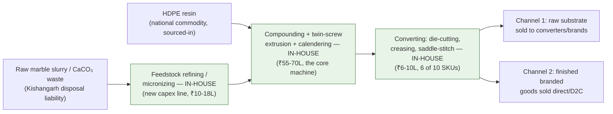

# Business Frameworks Compendium — 11 Strategy Frameworks Applied to Limepaper

*Part of the Limepaper business plan — see [00_README_Index.md](00_README_Index.md). Added 11 Sep 2026.*

**What this doc is.** The founder asked to understand eleven standard strategy frameworks — not as textbook definitions, but applied concretely to Limepaper's actual situation: a bootstrapped two-founders-plus-father stone-paper venture in Kishangarh/Rajsamand, pre-revenue, pre-plant, with the risk profile already documented in [14_Founder_Reality_Check.md](14_Founder_Reality_Check.md). Each section gives a short plain-English definition, then Limepaper's honest answer. Where a framework exposes a weakness, this doc says so rather than reframing it as a strength — consistent with [14_Founder_Reality_Check.md](14_Founder_Reality_Check.md)'s stated purpose. Customer persona is deliberately excluded below — it's covered in full in [21_Customer_Knowledge_Playbook.md](21_Customer_Knowledge_Playbook.md); duplicating it here would just create two documents to keep in sync.

---

## 22.1 Business Model Canvas

**Definition.** A one-page map of how a business creates, delivers and captures value, split into nine blocks: who you partner with, what you do and own, what you offer, how you relate to and reach customers, who those customers are, and how money flows in and out. Useful mainly as a completeness check — a gap in one block usually means an unanswered question elsewhere in the plan.

| Block | Limepaper's answer |
| :---- | :---- |
| **Key Partners** | The micronized-CaCO₃/marble-slurry supplier(s) in Kishangarh (feedstock, [03_Unit_Economics.md](03_Unit_Economics.md) §4.1); a national HDPE resin distributor (Reliance/GAIL-linked, §4.2) — the larger and more volatile of the two input relationships; the extrusion-line vendor (largest single capex decision, [17_Factory_Operations_Plan.md](17_Factory_Operations_Plan.md) §17.2.1); a lending bank against the ₹70L shop collateral ([07_Capital_Plan.md](07_Capital_Plan.md)); a CA/lawyer for the GST/HSN advance ruling ([13_Paper_Industry_Economics_Deep_Dive.md](13_Paper_Industry_Economics_Deep_Dive.md) §13.6); RIICO/DIC for the Rajasthan Circular Economy Incentive Scheme (§4.5). No converting, printing, or logistics partner is locked in yet — cover printing for notebooks stays outsourced at Stage 1 ([18_Product_SKU_Catalog.md](18_Product_SKU_Catalog.md) §18.2). |
| **Key Activities** | In-house feedstock refining/micronizing, extrusion + compounding + calendering, converting (die-cutting, saddle-stitching) into the ten SKUs, technical/lab-data B2B selling ([09_B2B_Client_Acquisition.md](09_B2B_Client_Acquisition.md) §11.2), and — not yet started — the diligence gate items in [14_Founder_Reality_Check.md](14_Founder_Reality_Check.md) (Ston2pack diligence, per-SKU cash-flow model, GST ruling, LOIs, bank valuation). |
| **Key Resources** | The ₹70L family shop (clear title) and ~₹10L silver as loan collateral; Sanjay's ~4 years carton-industry network and experience (the plan's actual go-to-market asset in Channel 1, [20_Data_Metrics_Framework.md](20_Data_Metrics_Framework.md) §20.1.1); proximity to Kishangarh's marble-slurry dumping yard (feedstock security, not cost advantage — §4.1); the eventual extrusion + converting line itself once commissioned. Notably *not yet* a resource: any lab certification, signed LOI, brand, or track record — all zero as of this doc ([20_Data_Metrics_Framework.md](20_Data_Metrics_Framework.md) §20.1.2). |
| **Value Propositions** | To Channel 1 (converters/brands): a tear-resistant, waterproof, locally-sourced substrate with a credible feedstock-diversion story, priced against Chinese import FOB as the ceiling ([13_Paper_Industry_Economics_Deep_Dive.md](13_Paper_Industry_Economics_Deep_Dive.md) §13.4.1). To Channel 2 (D2C/gifting buyers): a premium, story-led "made from Kishangarh's marble waste" object at 2–5x conventional retail pricing ([18_Product_SKU_Catalog.md](18_Product_SKU_Catalog.md) §18.2). Neither proposition is "plastic-free" — that claim is not defensible ([16_Process_Environmental_Profile.md](16_Process_Environmental_Profile.md) §16.4) — the honest proposition is tree-free, water-free, and performance-differentiated. |
| **Customer Relationships** | Channel 1: high-touch technical qualification (samples → lab test → pilot order → vendor audit → approved-vendor listing, [21_Customer_Knowledge_Playbook.md](21_Customer_Knowledge_Playbook.md) §21.1) — a 3–9 month relationship-building cycle, not a transaction. Channel 2: self-service D2C storefront/marketplace, low-touch, story-and-photography-led (§21.2). These are structurally different relationship models running off the same factory, which is why [21_Customer_Knowledge_Playbook.md](21_Customer_Knowledge_Playbook.md) §21.3 insists on two separate sales artifacts rather than one deck. |
| **Channels** | Channel 1: IndiaMART/TradeIndia listings, trade shows (PackPlus, PrintPack India), direct outbound, Sanjay's network referrals ([09_B2B_Client_Acquisition.md](09_B2B_Client_Acquisition.md) §11.2). Channel 2: Instagram/social, a D2C storefront, Amazon/Flipkart once volume justifies it ([21_Customer_Knowledge_Playbook.md](21_Customer_Knowledge_Playbook.md) §21.2). See §22.10 below on whether B2B marketplaces belong in this mix at all. |
| **Customer Segments** | Packaging converters/FMCG-pharma procurement (Channel 1, ranked in [13_Paper_Industry_Economics_Deep_Dive.md](13_Paper_Industry_Economics_Deep_Dive.md) §13.7: corporate gifting first, pharma/industrial labels in parallel, e-commerce mailers selectively); individual gifting shoppers and corporate-CSR bulk buyers (Channel 2, [21_Customer_Knowledge_Playbook.md](21_Customer_Knowledge_Playbook.md) §21.2). Full breakdown in §22.4 below. |
| **Cost Structure** | Dominant line: HDPE resin (~65–75% of raw-material cost, national petrochemical commodity, not a local advantage, [03_Unit_Economics.md](03_Unit_Economics.md) §4.2). Fixed costs: a ₹1.5cr collateral-backed term loan's EMI, a 4–5 person floor crew ([17_Factory_Operations_Plan.md](17_Factory_Operations_Plan.md) §17.3.1), lease, utilities. The plan's own reality check ([14_Founder_Reality_Check.md](14_Founder_Reality_Check.md) §4) flags that none of these have been modeled per-SKU or against a loan-repayment schedule yet — a real gap, not a settled cost structure. |
| **Revenue Streams** | Two channels off one line: (1) raw substrate/sheet wholesale to converters — thin margin, primary Stage 1 plan, LOI-gated before equipment order ([03_Unit_Economics.md](03_Unit_Economics.md) §4.7); (2) finished branded goods across ten SKUs — captures converting margin, priced by the cost + min(cost×70%, ₹2.00) rule ([18_Product_SKU_Catalog.md](18_Product_SKU_Catalog.md) §18.0.2). Both streams are currently ₹0 — this canvas describes intended, not actual, revenue. |

---

## 22.2 MOAT Canvas

**Definition.** A moat is a structural reason competitors can't easily copy or erode a company's advantage — not "we work hard" or "we care about quality," but something a well-funded rival would still struggle to replicate. Common moat types include cost advantage, network effects, switching costs, brand, IP, and regulatory capture. Most startups have thin or no moat at launch; the honest exercise is naming what's real versus aspirational.

Rated against Limepaper's actual position, not the pitch-deck version:

* **Feedstock position — real, but not exclusive.** Kishangarh's marble-slurry disposal crisis is genuine and Limepaper's proximity is a real logistics/relationship advantage (§4.1). But nothing prevents Ston2pack's successor, a well-funded new entrant, or an existing cement/mineral player from negotiating a similar or better offtake deal with the same slurry processors — there's no exclusivity, long-term supply contract, or captive mine. It's a head start, not a fortress, and CaCO₃ is in any case the cheap ~80%-by-mass input; HDPE, the expensive line, is sourced nationally and confers no local edge at all (§4.2).
* **Vertical integration — real and meaningfully differentiating, at least relative to the stated competitive set.** In-house feedstock refining + extrusion + converting on one site ([17_Factory_Operations_Plan.md](17_Factory_Operations_Plan.md)) is more integrated than competitors who typically buy pre-made sheet and just convert, or buy pre-purified powder rather than refining their own feedstock (§4.2.1). This is the plan's most genuine differentiation claim — see §22.8 for the full stack comparison. It is not, however, protected by anything besides capital and operational competence; any competitor with similar capital could replicate it.
* **Brand — currently nonexistent.** Zero sales, zero customers, zero reviews, zero social presence as of this doc ([20_Data_Metrics_Framework.md](20_Data_Metrics_Framework.md) §20.1.2). Karst (global) and the dormant Ston2pack/Whitestone both had more brand equity than Limepaper does today. Not a moat yet — a multi-year build, if it happens at all.
* **IP/patents — none.** Stone paper's core process (CaCO₃ + HDPE compounding, twin-screw extrusion) is a decades-old, widely licensed technology (TBM/Taiwan pioneered it commercially; [04_Competitive_Landscape.md](04_Competitive_Landscape.md) §5.1). Limepaper holds no proprietary formulation, process patent, or trade secret that a competent competitor couldn't reverse-engineer from a purchased sample.
* **Switching costs — the most plausible near-term moat, but thin and unproven.** See §22.3.
* **Network effects — none.** This is a manufacturing business selling a physical substrate, not a platform or marketplace. More customers do not make the product better for existing customers; there is no two-sided dynamic to defend.

**Honest read:** Limepaper's real moat candidates today are feedstock proximity (real but replicable) and vertical integration (real but capital-replicable), stacked with a technical-qualification switching cost that only exists *after* a customer is won. None of these is a durable, hard-to-copy moat in the classic sense (patent, network effect, regulatory exclusivity). This matches [14_Founder_Reality_Check.md](14_Founder_Reality_Check.md)'s broader finding that the plan's discipline is sound but its competitive thesis is largely unproven.

---

## 22.3 Switching Costs

**Definition.** The cost — in money, time, risk, or effort — a customer incurs to leave your product for a competitor's. High switching costs make revenue sticky even without a formal contract; low switching costs mean every renewal is a fresh sales pitch.

Limepaper's realistic switching-cost story is not contractual lock-in (no B2B buyer signs multi-year exclusivity with an unproven, first-year vendor) — it's **technical requalification cost**. Per [21_Customer_Knowledge_Playbook.md](21_Customer_Knowledge_Playbook.md) §21.1, a B2B packaging/procurement buyer's actual buying process is: sample → internal lab/quality check against spec → pilot order → supplier audit → approved-vendor listing → repeat purchase orders, running 3–9 months (12+ at large accounts). Once a converter has invested that cycle in qualifying Limepaper's substrate against their own packaging line — tuned die-cutting tolerances, confirmed print compatibility (UV-curable ink, not standard offset, §22-adjacent §18.3), validated tear/water-resistance specs — switching to a new supplier means re-running that entire qualification cycle from zero, not just re-negotiating price. That's real friction, and it's the honest reason a won B2B account is worth defending hard.

The caveats that keep this from being a strong moat:

* **It's zero until the first account is won.** As of this doc, Limepaper has closed zero LOIs and zero POs ([20_Data_Metrics_Framework.md](20_Data_Metrics_Framework.md) §20.1.2) — there is no switching cost yet protecting any revenue, because there's no revenue.
* **It cuts both ways early on.** The same qualification friction that will eventually protect Limepaper from being displaced is, right now, the friction slowing Limepaper's own ability to win business away from an incumbent supplier (mostly conventional paper/plastic converters, since there's effectively no live India stone-paper competitor to switch customers away from, [04_Competitive_Landscape.md](04_Competitive_Landscape.md) §5.4).
* **Channel 2 (D2C/retail) has almost none of this.** A notebook or carry-bag buyer on a storefront faces no requalification cost at all — that revenue is inherently less sticky, and repeat purchase there is upside rather than the load-bearing mechanic it is for Channel 1 ([20_Data_Metrics_Framework.md](20_Data_Metrics_Framework.md) §20.2).
* **A GST/HSN reclassification could reset the qualification math for every account simultaneously** — if the product's tax treatment shifts materially ([13_Paper_Industry_Economics_Deep_Dive.md](13_Paper_Industry_Economics_Deep_Dive.md) §13.6), a buyer's landed-cost assumption changes and the "sticky" relationship is exposed to a repricing conversation, not protected from one.

---

## 22.4 Market Segmentation

**Definition.** Breaking a market into groups of buyers who share similar needs, willingness to pay, and buying behavior, so a plan can target and prioritize rather than pitch everyone the same way. Good segmentation combines a "who" axis (industry/buyer type) with a "what" axis (product type), because the same buyer can want different things depending on the product.

Combining the sector segments from [02_Market_Opportunity.md](02_Market_Opportunity.md) §3.2 and the product-type ranking from [13_Paper_Industry_Economics_Deep_Dive.md](13_Paper_Industry_Economics_Deep_Dive.md) §13.7:

| Sector segment | Relevant product type(s) | Priority (per §13.7) | Notes |
| :---- | :---- | :---- | :---- |
| Corporate gifting / CSR-ESG procurement | Notebooks, diaries, premium carry bags | **#1 — lead with this** | No certification barrier, fastest revenue, proven willingness to pay (50–150%+ premium accepted); low working-capital exposure; Ston2pack/Whitestone already proved demand here before going dormant |
| Pharma secondary packaging | Folding cartons, mono-cartons | **#2 — parallel priority** | Buyers already pay for moisture resistance via coatings; stone paper delivers it natively. Realistically a Year 3+ segment for vendor-audit reasons, not week-one ([14_Founder_Reality_Check.md](14_Founder_Reality_Check.md) §2) |
| Industrial labels, tags, signage | Self-adhesive labels, hang tags, menus, signage panels | **#3 — best margin-per-tonne** | Competes against PVC/PP synthetic paper, not wood-pulp — property-match is the entire sale |
| FMCG packaging (general) | Raw sheet/roll substrate, packaging cartons | Folded into #1/#2 above | Largest global segment by share (37.9%) but Limepaper's realistic entry is via converters, not direct FMCG accounts, at Stage 1 |
| E-commerce/mailer buyers | Padded/kraft mailer envelopes | #4 — selective only | Structurally cost-anchored to poly mailers (₹1.30–6/piece); only the premium-D2C-brand sub-slice fits |
| Premium retail (jewellery, bridal, apparel) | Premium carry bags, rigid-box decorative wrap | Expansion horizon, gated on glue/foil trials ([18_Product_SKU_Catalog.md](18_Product_SKU_Catalog.md) §18.9.4) | Genuine Tier-1 candidate once trials clear; target Indian premium retail, not European luxury (LVMH/Kering are actively de-plasticizing) |
| Government/institutional | Stationery, tenders | #5 — build toward | GeM green-procurement signal exists but no confirmed mandate; 18–24 month horizon |
| Food service (bakery/QSR) | Grease-resistant wraps, box liners | #6 — deprioritize | FSSAI food-contact certification for the HDPE fraction is unresolved |
| Individual retail/gifting | Notebooks, small bags | Channel 2, ongoing | Story-and-feel-driven, not spec-driven; lowest order value, shortest cycle ([21_Customer_Knowledge_Playbook.md](21_Customer_Knowledge_Playbook.md) §21.2) |

The two axes matter together: the same product (a notebook) sells on almost opposite criteria to a corporate-gifting procurement buyer (ESG scorecard, bulk pricing, formal sign-off) versus an individual retail shopper (feel, story, impulse) — treating "notebooks" as one segment rather than two would misdirect the sales motion, which is exactly why [21_Customer_Knowledge_Playbook.md](21_Customer_Knowledge_Playbook.md) builds two separate personas rather than one.

---

## 22.5 Porter's Five Forces

**Definition.** A framework for rating how attractive an industry's structural economics are, independent of any one company's execution — by scoring five competitive pressures: how easy it is for new entrants to arrive, how much leverage suppliers and buyers each hold, whether substitutes threaten to win on price/convenience, and how intense rivalry is among existing players. Low pressure across the board means an industry is structurally profitable; high pressure on most forces means margins get competed away regardless of strategy.

| Force | Rating | Reasoning |
| :---- | :---- | :---- |
| Threat of new entrants | **Medium** | Capex is a real barrier (₹1.5–17.2cr depending on scale, [03_Unit_Economics.md](03_Unit_Economics.md) §4.3) and the process knowledge isn't trivial — but it's also not proprietary (decades-old TBM-pioneered technology, licensable, widely known in East Asia, [04_Competitive_Landscape.md](04_Competitive_Landscape.md) §5.1), and any cement/mineral-adjacent player in Rajasthan could plausibly enter with more capital than Limepaper has. |
| Bargaining power of suppliers | **Medium-High** | CaCO₃ suppliers have weak leverage — multiple slurry processors actively want offtake, pricing is near the global low end (§4.1). But HDPE, the dominant cost line (~65–75% of raw-material cost), is a national petrochemical commodity from a handful of large domestic producers (Reliance/GAIL) who have demonstrated real pricing power — a ₹13,000/t swing in 9 days in July 2026 ([13_Paper_Industry_Economics_Deep_Dive.md](13_Paper_Industry_Economics_Deep_Dive.md) §13.4.3) — leaving Limepaper a price-taker on its largest cost line. |
| Bargaining power of buyers | **High** | B2B buyers hold most of the leverage: large FMCG/pharma accounts run formal multi-sign-off vendor qualification and can walk away at zero cost pre-approval; Chinese export FOB pricing (~₹94,000–108,000/t) sets a brutal ceiling any buyer can hold Limepaper to on raw substrate ([13_Paper_Industry_Economics_Deep_Dive.md](13_Paper_Industry_Economics_Deep_Dive.md) §13.4.1); and a first-year, unproven vendor has essentially no negotiating leverage of its own. |
| Threat of substitutes | **High** | Conventional wood-pulp/recycled paper is the dominant substitute for nearly every SKU and is structurally cheaper (₹32,500–55,000/t wholesale vs. stone paper's ₹60,000–108,000+/t, §13.4.2); poly mailers undercut paper mailers entirely on cost (₹1.30–6/piece); PVC/PP synthetic paper is the incumbent in labels/tags. Stone paper wins on property (waterproof, tear-resistant) and story, never on price — every segment is a substitution sale against an entrenched, cheaper alternative. |
| Competitive rivalry | **Low, but for an unresolved reason** | Only one branded India competitor (Ston2pack/Whitestone) has ever existed, and it appears dormant since 2022–23 ([04_Competitive_Landscape.md](04_Competitive_Landscape.md) §5.4) — genuinely low current rivalry. But low rivalry in a category where the only prior entrant quietly failed is not unambiguously good news: it could mean genuine white space, or it could mean the category doesn't work yet in India at this scale — the diligence gap [14_Founder_Reality_Check.md](14_Founder_Reality_Check.md) §1 and §7 both flag as unresolved and high-priority. |

**Net read:** two forces (buyer power, substitute threat) are genuinely unfavorable and structural — they don't go away with better execution. New-entrant threat and supplier power are mixed. Rivalry is low today, but for a reason that could just as easily be a warning as an opportunity. This is not a five-forces profile that says "attractive industry, just execute" — it says "thin category, real substitution pressure, win on differentiation or not at all," consistent with [13_Paper_Industry_Economics_Deep_Dive.md](13_Paper_Industry_Economics_Deep_Dive.md) §13.1's own framing.

---

## 22.6 Category Creation Formula

**Definition.** Category creation is the claim that a company isn't just building a better version of an existing product, but defining a genuinely new buyer category — with the first-mover framing advantages (setting the vocabulary, owning the "category king" position) that implies. It's a high-value claim when true and a common startup self-deception when it isn't; most "category creators" are actually entering an already-published category earlier than most buyers have noticed it.

**Honest answer: Limepaper is entering a category, not creating one.** "Stone paper" is an established, if small and nascent-in-India, global category — pioneered commercially by TBM (Taiwan) decades ago, with a real global market (~USD 1.06bn, 2026) and functioning brands (Karst as the global B2C benchmark, multiple B2B packaging players, [04_Competitive_Landscape.md](04_Competitive_Landscape.md) §5.1). India already has a published precedent: Ston2pack/Whitestone Stationeries ran a branded B2B+B2C stone-paper business from 2021–2023 before going dormant ([04_Competitive_Landscape.md](04_Competitive_Landscape.md) §5.4). Limepaper did not invent the substrate, the process, or the India go-to-market playbook — all three already exist, documented, with a real (if unexplained) India failure case to learn from.

What Limepaper can honestly claim is narrower and more defensible than category creation: **category entry with a genuine sourcing and vertical-integration angle** — no India competitor advertises a captive, mine-mouth position inside the Rajasthan marble belt (§4.1), and none is known to run feedstock refining in-house rather than buying purified powder (§22.8). That's a real differentiation within an existing category, not a new category. Claiming category creation would be a marketing overreach a sophisticated investor or journalist could puncture immediately by pointing to TBM, Karst, or Ston2pack's own trade-press history — the same discipline [14_Founder_Reality_Check.md](14_Founder_Reality_Check.md) applies to the "plastic-free" claim applies here: say the true, narrower thing.

---

## 22.7 Red Ocean vs. Blue Ocean

**Definition.** A "red ocean" is a crowded, mature market where competitors fight over the same customers mostly on price — the water is bloody with competition. A "blue ocean" is uncontested market space, either genuinely new or under-served enough that existing rivals aren't really fighting there yet. Few businesses are purely one or the other; most compete in a blue pocket that still touches a much larger red ocean at its edges.

Limepaper's honest position is that it swims in both waters simultaneously, and the plan only works if that's held clearly rather than confused:

* **India's stone-paper category specifically is blue.** Thin competition — one branded entrant (Ston2pack), apparently dormant, plus a handful of small unverified traders/converters on IndiaMART ([04_Competitive_Landscape.md](04_Competitive_Landscape.md) §5.2) and no player claiming Limepaper's captive-feedstock angle. Genuine uncontested space, at least for now — though "blue because everyone else left or never came" is a different, more cautionary flavor of blue than "blue because the market is new and hasn't been discovered yet."
* **But every Limepaper sale is actually competing in wood-pulp paper's deep red ocean.** The real competitive water for any given SKU is not other stone-paper makers — it's India's ≈23.8 million-tonne conventional paper industry, running thin, commoditized, price-driven margins ([13_Paper_Industry_Economics_Deep_Dive.md](13_Paper_Industry_Economics_Deep_Dive.md) §13.1–13.2), plus PVC/PP synthetic paper in labels and poly mailers in e-commerce packaging. Every one of those incumbents is cheaper, familiar to the buyer, and backed by established supply chains, recycling infrastructure, and decades of buyer trust. Stone paper cannot win that fight on price or familiarity — §13.5's "bottom line" is explicit that it doesn't try to.
* **The honest frame:** Limepaper isn't creating uncontested space in the way "blue ocean" strategy classically describes (e.g., Cirque du Soleil redefining circus economics) — it's occupying a small, thinly-competed niche (stone paper in India) that only survives commercially by selling *against* a much larger, brutally price-competitive red ocean (conventional paper/plastic), on differentiation (waterproof, tear-resistant, ESG story) rather than cost. The blue water is real but narrow; the red water is what determines whether any given customer says yes.

---

## 22.8 Vertical Integration

**Definition.** Vertical integration means owning multiple stages of a value chain — from raw input through to finished product — rather than buying pre-processed inputs from outside suppliers at each stage. It trades capital intensity and operational complexity for margin capture, quality control, and supply security; the alternative (staying "thin" and buying in) is cheaper to start but leaves you dependent on, and price-taking from, every upstream supplier.

Limepaper's actual stack, as currently planned, versus the typical competitor pattern described in [03_Unit_Economics.md](03_Unit_Economics.md) §4.2.1 and [17_Factory_Operations_Plan.md](17_Factory_Operations_Plan.md):

* **Typical competitor:** buys already-purified micronized CaCO₃ powder from a third-party micronizing unit *or* buys pre-made stone-paper sheet from a converter/importer and simply finishes it (die-cuts, prints, binds) — the lowest-capex, lowest-control entry point into the category.
* **Limepaper:** in-house feedstock refining/micronizing (new capex line, §17.2.0) → in-house extrusion + compounding + calendering (the core machine, §17.2.1) → in-house converting (die-cutting, saddle-stitching, six of ten SKUs on one shared line, §17.2.2) — all on one site, from day one.

*(Green boxes are stages a typical competitor buys in rather than owns — see [04_Competitive_Landscape.md](04_Competitive_Landscape.md) for the competitor set this contrasts against.)*

This is genuinely more integrated than the typical model, and it's the plan's most defensible operational claim — [14_Founder_Reality_Check.md](14_Founder_Reality_Check.md)'s "what's genuinely good" section explicitly credits owning extrusion from day one as making the mine-mouth story real rather than rhetorical, contrasting it with a converting-only business buying Chinese sheet, which "had no defensible moat." But integration cuts both ways: it also means Limepaper absorbs feedstock-purification risk, extrusion-process risk, *and* converting risk simultaneously, on a single ₹1.5cr collateral-backed line, rather than spreading that risk across specialized vendors the way a thinner competitor would. More control, more exposure — not a free upgrade.

One stage stays deliberately outsourced even in this integrated model: cover printing for notebooks remains external at Stage 1 ([18_Product_SKU_Catalog.md](18_Product_SKU_Catalog.md) §18.2) — a genuine, not accidental, gap in the stack, held back for capital reasons rather than strategic ones.

---

## 22.9 Horizontal Integration

**Definition.** Horizontal integration means expanding across a market at the same stage of the value chain — acquiring or building competing/adjacent product lines, additional sites, or new customer segments at the level you already operate — as distinct from vertical integration's up/down-the-chain expansion. It's a growth-stage move, not typically a day-one one.

**Honest answer: not really applicable at Limepaper's current stage, and pretending otherwise would misrepresent the plan.** Limepaper is a single product category (stone paper, in its ten-SKU forms) at a single site (one Kishangarh/Rajsamand plant), pre-revenue. There is no second product line, no second site, and no acquisition target under consideration — horizontal integration isn't a current strategy, it's not on the roadmap, and this doc won't manufacture a growth narrative where none exists yet.

What it could plausibly look like later, if Stage 1 proves out and Stage 2's ₹15cr raise materializes ([07_Capital_Plan.md](07_Capital_Plan.md) §9.3):

* **Adjacent mineral-composite products** beyond paper-format sheet — the same CaCO₃/HDPE compounding process, at different thickness/formulation, could in principle extend toward other filled-polymer composite products (the extrusion/compounding know-how is the transferable asset, not the "paper" framing specifically). Entirely speculative at this stage — no research, costing, or market validation exists for this anywhere in the plan.
* **A second site**, likely still within Rajasthan's marble belt to preserve the feedstock-proximity logic, once Stage 1 utilization data justifies it — mirroring the "add capacity against demonstrated demand, not anticipated growth" discipline already applied to floor headcount ([17_Factory_Operations_Plan.md](17_Factory_Operations_Plan.md) §17.3.2–17.3.3).
* **Acquiring or partnering with an adjacent converter** (e.g., a rigid-box/set-up-box maker, since Limepaper's own sheet can only supply the decorative wrap layer of a rigid box, not the structural core — [18_Product_SKU_Catalog.md](18_Product_SKU_Catalog.md) §18.9.3) to capture more of that value chain horizontally rather than vertically.

None of this belongs in the Stage 1 plan. Naming it here is explicitly to distinguish "a thing that could happen later" from "a thing we're doing" — the same discipline [08_Implementation_Roadmap.md](08_Implementation_Roadmap.md) applies by deferring the label die-cutter and lamination line rather than pretending Stage 1 covers everything.

---

## 22.10 Marketplaces

**Definition.** The question of whether to sell through a third-party B2B marketplace (IndiaMART, TradeIndia, Amazon Business) versus direct sales — trading the marketplace's built-in discovery and lower cold-account CAC for reduced pricing control, commoditization risk, and a thinner, more transactional customer relationship than a direct sale builds.

Weighed separately for Limepaper's two channels, since the tradeoff is genuinely different for each:

**Channel 1 (raw substrate to converters).** [09_B2B_Client_Acquisition.md](09_B2B_Client_Acquisition.md) §11.2 already lists IndiaMART/TradeIndia listings as a tactic, and every India competitor has a presence there ([04_Competitive_Landscape.md](04_Competitive_Landscape.md) §5.2) — so absence would be a conspicuous gap, not a differentiator. But the honest tension: this channel already runs on thin, commodity-adjacent margins where Chinese export FOB pricing sets a brutal price ceiling ([13_Paper_Industry_Economics_Deep_Dive.md](13_Paper_Industry_Economics_Deep_Dive.md) §13.4.1), and a marketplace listing invites exactly the price-comparison behavior that erodes those margins further. More importantly, per §22.3, the real value in Channel 1 is the technical-qualification relationship that builds switching costs — a marketplace inbound lead is the *start* of that relationship (a way to get found by a cold account, genuinely lower CAC than trade-show attendance per lead), not a substitute for the 3–9 month sample-lab-pilot-audit cycle that actually wins and locks in the account. **Verdict: use marketplaces for discovery only, on Channel 1 — list to get found by accounts that don't yet know Limepaper exists, then immediately move the qualified lead off-platform into the direct technical relationship.** Never treat marketplace order volume itself as the target; treating it as a real revenue channel invites commoditization on the segment's already-thinnest margin.

**Channel 2 (finished branded goods).** Different calculus. [21_Customer_Knowledge_Playbook.md](21_Customer_Knowledge_Playbook.md) §21.2 already identifies Amazon/Flipkart as a channel "once volume justifies it" — for D2C retail, marketplaces are a legitimate discovery and fulfillment channel because the buying decision is story/photography-led and low-touch by nature (minutes to days, not months, §21.3), so there's no deep qualification relationship for a marketplace listing to undercut. The real risk here isn't relationship erosion — it's brand dilution: a generic Amazon listing competing on a sortable price grid against Classmate/Navneet-tier notebooks undersells the very story (2–5x premium, justified by feel and narrative, [18_Product_SKU_Catalog.md](18_Product_SKU_Catalog.md) §18.2) that Channel 2 depends on. **Verdict: marketplaces are appropriate for Channel 2 once a storefront and brand presence exist to anchor pricing and story, but the primary motion should stay the D2C storefront/social channel — treat marketplace listings as a volume/discovery supplement, not the brand's home.**

**Across both channels, the underlying caution is the same:** Limepaper doesn't yet have pricing power, brand recognition, or proven quality consistency — three things that make a marketplace listing safe. Listing too early, before lab certification (Channel 1) or before a coherent storefront/story exists (Channel 2), risks the plant's first public price and quality signal being set by a marketplace algorithm rather than a deliberate go-to-market choice.

---

## 22.11 SWOT Analysis

**Definition.** A structured internal/external audit — Strengths and Weaknesses look inward (what's actually true about the business today), Opportunities and Threats look outward (what the environment could hand you or take from you). Useful only if the weaknesses and threats are as specific and unflattering as the strengths are — a SWOT that reads like a pitch deck isn't doing its job.

| | Helps | Hurts |
| :---- | :---- | :---- |
| **Internal** | **Strengths**: real in-house vertical integration (feedstock refining → extrusion → converting, §22.8); genuine Kishangarh feedstock proximity and slurry-diversion story (§4.1); Sanjay's ~4 years carton-industry network, the plan's actual go-to-market asset for Channel 1 ([20_Data_Metrics_Framework.md](20_Data_Metrics_Framework.md) §20.1.1); a self-imposed hard ₹1.5cr borrowing ceiling and no-new-debt-until-50%-repaid discipline most first-time founders don't self-impose ([14_Founder_Reality_Check.md](14_Founder_Reality_Check.md), "what's genuinely good"). | **Weaknesses**: zero revenue, zero LOIs, zero lab certification, zero brand as of this doc; capex precedes revenue by design — every month of commissioning delay is a month of debt service against zero sales ([14_Founder_Reality_Check.md](14_Founder_Reality_Check.md) §6); a ₹1.5cr loan against a family whose largest prior credit ticket was ₹5L (roughly 30x scale jump, §Verdict); no moat that survives a well-capitalized copycat (§22.2); GST/HSN classification genuinely unresolved and could swing margin 6–13 points ([13_Paper_Industry_Economics_Deep_Dive.md](13_Paper_Industry_Economics_Deep_Dive.md) §13.6); "plastic-free" is not a defensible claim and the product is not biodegradable, compostable, or recyclable in standard India streams — a real greenwashing exposure if discovered rather than disclosed ([16_Process_Environmental_Profile.md](16_Process_Environmental_Profile.md) §16.4). |
| **External** | **Opportunities**: India's SUP restrictions and FMCG ESG mandates create a genuine regulatory tailwind ([02_Market_Opportunity.md](02_Market_Opportunity.md) §3.3); India's stone-paper market growing 8.8% CAGR off a small base; Ston2pack's dormancy may mean the market is more open than it looks, and its former buyers/ex-employees are a warm-lead opportunity ([04_Competitive_Landscape.md](04_Competitive_Landscape.md) §5.4); Rajasthan's Circular Economy Incentive Scheme offers real subsidy access for a ≥51%-recycled-input plant (§4.5); premium carry bags and rigid-box wraps are a genuine, currently unclaimed expansion horizon pending glue/foil trials ([18_Product_SKU_Catalog.md](18_Product_SKU_Catalog.md) §18.9.5). | **Threats**: HDPE price volatility — a documented ₹13,000/t (≈11%) swing in 9 days, July 2026 ([13_Paper_Industry_Economics_Deep_Dive.md](13_Paper_Industry_Economics_Deep_Dive.md) §13.4.3) — on the cost line that dominates the business; why Ston2pack, the one India company that proved demand, went quiet after 2022–23 is genuinely unexplained and could recur for the same reasons ([14_Founder_Reality_Check.md](14_Founder_Reality_Check.md) §1, §7); India's conventional paper industry is a deep, structurally cheaper substitute Limepaper can never win on price against (§13.1); no alternative financing instrument (leasing, phased drawdown) has been priced against pledging the family's only major asset before that pledge happens ([14_Founder_Reality_Check.md](14_Founder_Reality_Check.md) §7); a market this plan itself sizes at ≈USD 59–123m may not support the ₹15cr/₹150cr-post-money Stage 2 ask regardless of how well Stage 1 executes (§13.8). |

None of the weaknesses or threats above are new — they're the same items [14_Founder_Reality_Check.md](14_Founder_Reality_Check.md) and its §7 council review already flagged as unresolved. Restating them here in SWOT form is deliberate: a framework exercise that softened them into generic "risks and mitigations" language would defeat the purpose of running the framework at all.

---

## Next

* The buyer-level detail behind the segmentation and switching-cost frameworks above → [21_Customer_Knowledge_Playbook.md](21_Customer_Knowledge_Playbook.md) (persona framework lives there, not duplicated here)
* The unresolved risk items several frameworks above point back to → [14_Founder_Reality_Check.md](14_Founder_Reality_Check.md)
* The cost and pricing data underlying the segmentation and Porter's-forces sections → [13_Paper_Industry_Economics_Deep_Dive.md](13_Paper_Industry_Economics_Deep_Dive.md)
* Where CAC and retention get tracked once these frameworks meet real customers → [20_Data_Metrics_Framework.md](20_Data_Metrics_Framework.md)

---
*Sources listed centrally in [10_Sources.md](10_Sources.md).*
